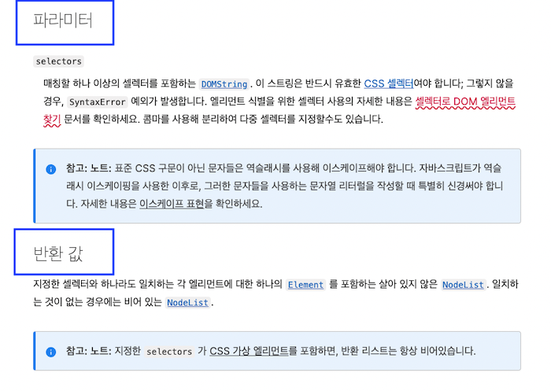
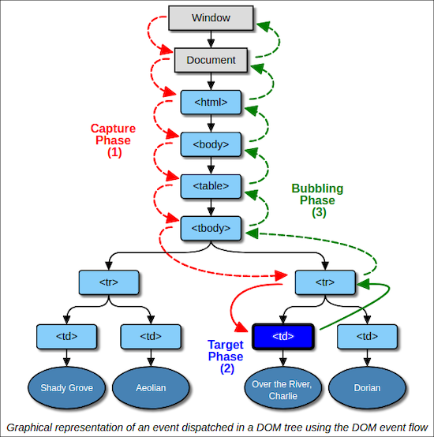

import { Sandpack } from "@codesandbox/sandpack-react";
import { githubLight } from "@codesandbox/sandpack-themes";
import { Alert, Collapse, Rate, Button, Result, Typography } from "antd";
import { SnippetsTwoTone, QuestionCircleTwoTone } from "@ant-design/icons";

<Result
  icon={<SnippetsTwoTone />}
  title="이벤트에 대해서 알아봅시다."
/>

# 이벤트

## 기본 개념

<Rate disabled={true} value={4} />
<br/>
<br/>

우리는 자바스크립트를 이용하여 웹 페이지에 생명력을 불어넣을 수 있습니다. 그 중 가장 강력한 힘은 **이벤트**로부터 발생합니다.

<br />
<Alert
  showIcon
  message="이벤트"
  description="이벤트란, 웹 페이지에서 사용자에 의해 발생하는 클릭, 스크롤 등과 같은 다양한 사건을 의미합니다."
  type="info"
/>

자바스크립트를 이용해 우리는, 사용자의 이벤트에 따라 우리의 자바스크립트 로직이 실행되게끔 연결할 수 있습니다.

예를 들어, 사용자가 특정 부분을 클릭했을때 어떤 로직을 실행한다던지 혹은 사용자가 웹 페이지에서 어떤 작업을 했을때 우리의 특정 로직을 실행한다던지와 같은 흐름을 구성할 수 있습니다.

무엇을 할 수 있게 해줄 수도 있고, 무엇을 못하게 해줄 수도 있습니다. 우리가 상상할 수 있는 범위를 넘어서는 매우 많은 것들을 할 수 있습니다.

이것들의 가장 근간이 되는 것이 바로 **이벤트**입니다.

우선 간단한 예시를 한번 보여드리면서 시작해볼까요?

<br />
<br />

##### 예시 1.
<br />

<Sandpack
  template="vanilla"
  theme={githubLight}
  files={{
    "/index.html": {
      code: `<html>
  <head>
    <link rel="stylesheet" href="./styles.css">
    <script defer src="./app.js"></script>
  </head>
  <body>
    <h1>클릭해보세요.</h1>
    
    <div id="scroll-box">
      <h2>스크롤 해보세요.</h2>
    </div>

    <p>나는 누구?</p>
  </body>
</html>`,
      active: true
    },
    "/app.js": {
      code: `const h1 = document.querySelector("h1");
const p = document.querySelector("p");
const scrollBox = document.querySelector("#scroll-box");

h1.addEventListener("click", function () {
  h1.textContent = "참 잘했어요.";
});

let count = 0;

scrollBox.addEventListener("scroll", function (event) {
  if (event.target.scrollTop > 600) {
    count++;

    if (count > 10) {
      count = 1;
    }

    p.textContent = "그만하세요" + "!".repeat(count);
  } else {
    p.textContent = "현재 위치는 " + event.target.scrollTop + "px.";
  }
});`
    },
    "/styles.css": {
      code: `#scroll-box {
  background-color: yellow;
  overflow: scroll;
  height: 120px;
}

h2 {
  height: 1000px;
  color: red;
}

h1 {
  color: blue;
}

p {
  position: fixed;
  top: 150px;
}`
    }
  }}
  options={{
    showLineNumbers: true,
    editorHeight: "400px",
    editorWidthPercentage: 60,
    initMode: "lazy",
    autoReload: false,
    showConsole: true,
    showConsoleButton: true,
  }}
  customSetup={{
    entry: "index.html",
  }}
/>

<br />
<br />

방금 보여드린 예시와 같이, 브라우저에서 사용자가 하는 매우 많은 행위들은 감지할 수 있는 방법들이 제공됩니다. 기본적인 클릭, 스크롤은 물론이고 그 외에도 많은 행위들을 감지할 수 있습니다.

어떤 행위들을 감지하고 그에 따라 자바스크립트 로직을 수행할 수 있는지 지금 모두 알려고 하지 마세요. 필요할때가 되었을때, 방법을 조사하면 됩니다. 지금은 우선, 기본적인 클릭이나 마우스, 키보드 이벤트 정도만 알고 계셔도 충분합니다.

> 전체 이벤트 목록이 나열된 [MDN 웹 페이지](https://developer.mozilla.org/en-US/docs/Web/Events)

<br />
<br />

## 요소 선택하기

<Rate disabled={true} value={3} />
<br/>
<br/>

우선 차근차근 시작하는 의미에서, 우리가 이벤트로 무언가를 작업하고 싶은 요소를 선택하는 방법들에 대해 잠시 살펴보겠습니다.

여러가지 방법이 있지만, 사용하기 가장 편리한 아래의 두 가지 방법을 우선 권장 드립니다.

- [`document.querySelector`](https://developer.mozilla.org/ko/docs/Web/API/Document/querySelector)
- [`document.querySelectorAll`](https://developer.mozilla.org/ko/docs/Web/API/Document/querySelectorAll)

<br />
<Alert
  showIcon
  message="`querySelector`은 웹 페이지에서 전달받은 CSS 선택자 문법과 일치하는 첫 번째 요소를 찾아주는 기능을 하며, `querySelectorAll`은 웹 페이지에서 전달받은 CSS 선택자 문법과 일치하는 모든 요소를 찾아 유사배열의 형태로 돌려주는 기능을 합니다."
  type="info"
/>

<br />
<br />

##### 예시 2.
<br />

<Sandpack
  template="vanilla"
  theme={githubLight}
  files={{
    "/index.html": {
      code: `<html>
  <head>
    <link rel="stylesheet" href="./styles.css">
    <script defer src="./app.js"></script>
  </head>
  <body>
    <p>app.js를 살펴보세요</p>
    <h1 class="heading">H1</h1>
    <h2 class="heading">H2</h2>
    <h3 class="heading">H3</h3>
    <h4 class="heading">H4</h4>
    <h5 class="heading">H5</h5>
  </body>
</html>`,
      active: true
    },
    "/app.js": {
      code: `const h1 = document.querySelector("h1");
const headings = document.querySelectorAll(".heading");

console.log(h1.textContent);
// headings라는 변수에 담긴 값은 유사배열이기에 인덱스를 사용할 수 있습니다.
console.log(headings[1].textContent);`
    },
    "/styles.css": {
      code: `h1 {
  color: red;
}

h2 {
  color: blue;
}

h3 {
  color: green;
}

h4 {
  color: purple;
}

h5 {
  color: aqua;
}`
    }
  }}
  options={{
    showLineNumbers: true,
    editorHeight: "400px",
    editorWidthPercentage: 60,
    initMode: "lazy",
    autoReload: false,
    showConsole: true,
    showConsoleButton: true,
  }}
  customSetup={{
    entry: "index.html",
  }}
/>

<br />
<br />

### 유사배열

자바스크립트를 학습하며, 유사배열이라는 단어를 자주 보게 될 수 있습니다. 유사배열이란 아래와 같은 정의를 갖습니다.

- 인덱스 체계를 사용할 수 있어야 하고, 인덱스를 이용해 요소에 대한 접근이 가능해야 한다.
- `length` 속성을 이용하여 요소의 갯수를 알 수 있어야 한다.
- 순수 배열이 아니어야 한다. (배열의 메소드를 사용할 수 없다.)

여러분은 이미 몇몇 유사배열을 알고 있습니다. 그 중 대표적인 것은 바로 **문자열**입니다. 자바스크립트의 문자열은 인덱스 체계를 갖고 있으며, `length` 속성을 갖고 있으며, 순수 배열은 아닙니다.

> 유사배열의 대표적인 예시) 문자열, arguments, HTMLCollection, NodeList

유사배열을 다룰때, 알고 있으면 도움이 되는 몇 가지가 있습니다.

<br />
<br />

#### 유사배열은 반복문 사용이 가능합니다.

<br />

##### 예시 3.

```js showLineNumbers copy
const str = "hello world";

for (let i = 0; i < str.length; i++) {
  console.log(str[i]);
}
```

<br />

##### 예시 4.

```js showLineNumbers copy
const headings = document.querySelectorAll(".heading");

for (let i = 0; i < headings.length; i++) {
  console.log(headings[i].textContent);
}
```

<br />
<br />

#### 유사배열은 실제 배열로 변환이 가능합니다.

<br />

##### 예시 5.

[`Array.from`](https://developer.mozilla.org/ko/docs/Web/JavaScript/Reference/Global_Objects/Array/from) 사용하여 변환하기 (가장 깔끔한 권장 방식)

```js showLineNumbers copy
const headings = document.querySelectorAll(".heading");

const realArray = Array.from(headings);

// 배열의 메소드 사용 가능
realArray.push("anything");
```

<br />

##### 예시 6.

[Spread 연산자](https://developer.mozilla.org/ko/docs/Web/JavaScript/Reference/Operators/Spread_syntax) 사용하여 변환하기 (때때로 유용한 방식)

```js showLineNumbers copy
const headings = document.querySelectorAll(".heading");

const realArray = [...headings];

// 배열의 메소드 사용 가능
realArray.push("anything");
```

<br />

##### 예시 7.

`Array.prototype` 사용하여 변환하기 (옛날 아저씨들의 방식이지만, 이해할 필요는 있음)

```js showLineNumbers copy
const headings = document.querySelectorAll(".heading");

const realArray = Array.prototype.slice.call(headings);

// 배열의 메소드 사용 가능
realArray.push("anything");
```

<br />
<br />

## 이벤트 등록하기

<Rate disabled={true} value={3} />
<br/>
<br/>

특정 요소에 이벤트를 등록하는 것은 다음과 같은 단계를 통해 이루어 집니다.

1. 원하는 요소를 선택한다.
2. 해당 요소에 이벤트를 등록한다.

방금 원하는 요소를 선택하는 방법에 대해 알아봤기 때문에, 이제는 이벤트를 등록하는 방법에 대해 살펴보도록 하겠습니다.

<br />

##### 예시 8.

<br />

<Sandpack
  template="vanilla"
  theme={githubLight}
  files={{
    "/index.html": {
      code: `<html>
  <head>
    <link rel="stylesheet" href="./styles.css">
    <script defer src="./app.js"></script>
  </head>
  <body>
    <p>app.js를 살펴보세요</p>
    <h1>Click!</h1>
  </body>
</html>`,
      active: true
    },
    "/app.js": {
      code: `const h1 = document.querySelector("h1");

function onClick () {
  console.log("I click!");
}

h1.addEventListener("click", onClick);`
    },
    "/styles.css": {
      code: `h1 {
  color: red;
}`
    }
  }}
  options={{
    showLineNumbers: true,
    editorHeight: "400px",
    editorWidthPercentage: 60,
    initMode: "lazy",
    autoReload: false,
    showConsole: true,
    showConsoleButton: true,
  }}
  customSetup={{
    entry: "index.html",
  }}
/>

<br />
<br />

<Alert
  showIcon
  message="addEventListener 주의!"
  description={<p>초보자 분들의 경우에 `addEventListener` 함수의 두 번째 인자로 함수를 전달해야 하는데, 그 부분에서 문법적인 실수가 발생하는 경우가 많으니 주의하세요!</p>}
  type="warning"
/>

<br />

##### 예시 9.

<br />

<Sandpack
  template="vanilla"
  theme={githubLight}
  files={{
    "/index.html": {
      code: `<html>
  <head>
    <link rel="stylesheet" href="./styles.css">
    <script defer src="./app.js"></script>
  </head>
  <body>
    <p>app.js를 살펴보세요</p>
    <h1 class="heading">H1</h1>
    <h2 class="heading">H2</h2>
    <h3 class="heading">H3</h3>
    <h4 class="heading">H4</h4>
    <h5 class="heading">H5</h5>
  </body>
</html>`,
      active: true
    },
    "/app.js": {
      code: `const headings = document.querySelectorAll(".heading");

function onClick (event) {
  console.log("I click " + event.target.textContent);
}

// "querySelectorAll"는 단일 요소를 돌려주지 않고,
// 요소들이 담긴 유사배열을 돌려주기 때문에
// 인덱스로 접근하여 단일 요소를 선택해 이벤트를 등록할 수 있다.
for (let i = 0; i < headings.length; i++) {
  const heading = headings[i];

  heading.addEventListener("click", onClick);
}`
    },
    "/styles.css": {
      code: `.heading {
  color: red;
}`
    }
  }}
  options={{
    showLineNumbers: true,
    editorHeight: "400px",
    editorWidthPercentage: 60,
    initMode: "lazy",
    autoReload: false,
    showConsole: true,
    showConsoleButton: true,
  }}
  customSetup={{
    entry: "index.html",
  }}
/>

위의 예시 코드에서 보면, 반복문을 이용해 순회하며 이벤트 등록을 하는 것을 확인할 수 있습니다. `querySelectorAll`는 이벤트 등록을 처리할 수 있는 단일 요소를 전달해주지 않고, 요소들이 담긴 유사배열([NodeList](https://developer.mozilla.org/ko/docs/Web/API/NodeList))의 형태를 돌려주기 때문에 각 요소를 선택해 이벤트 등록을 처리해주어야 하는 것입니다.

<br />
<br />

### MDN 문서에서 중요하게 볼 것들

모든 함수들의 MDN 문서를 보면 필수적으로 나열되어 있는 구성들이 있습니다.

- 파라미터
- 반환값

예를 들어, `querySelectorAll`이라고 한다면 아래와 같이 나와 있습니다.

<br />
<br />



<br />
<br />

<Alert
  showIcon
  message="문서 한 페이지 보는 것이 귀찮은 사람은 결코 성장할 수 없습니다."
  description={<p>여러분이 조사하고 있는 함수가 어떠한 파라미터를 받고, 어떠한 반환값을 돌려주는지는 기본적으로 꼼꼼히 살펴봐야 하는 부분입니다. 생각보다 많은 분들이 놓치는 부분이기도 하고, 이런 기본적인 부분에서 오는 약간의 나태함이 장기적인 시간 낭비로 이어질 수 있습니다.</p>}
  type="warning"
/>

<br />
<br />

#### 미션 🥸

MDN 문서에서 배열의 `push` 메소드의 반환값에 대해서 조사해보세요.

<br />
<br />

## 이벤트 위임

<Rate disabled={true} value={5} />
<br/>
<br/>

이벤트 시스템에는 **이벤트 위임**이라는 개념이 있습니다. 위임이라고 한다면, 누군가를 대리한다는 의미이긴 하지만 사실 이벤트 위임은 이벤트 발생의 흐름이라고 이해하는 것이 더 정확할것 같습니다.

저는 예시를 좋아하는 편이니, 예시를 통해 한번 살펴보도록 할까요?

<br />

##### 예시 10.

<br />

<Sandpack
  template="vanilla"
  theme={githubLight}
  files={{
    "/index.html": {
      code: `<html>
  <head>
    <link rel="stylesheet" href="./styles.css">
    <script defer src="./app.js"></script>
  </head>
  <body>
    html, js를 잘 읽어보시고, 초록색 부분을 클릭해보세요.

    <div id="red">
      <div id="green">
        클릭하면 콘솔에 무엇이 출력될까요?
      </div>
    </div>
  </body>
</html>`,
      active: true
    },
    "/app.js": {
      code: `const red = document.querySelector("#red");
const green = document.querySelector("#green");

function onRedClick (event) {
  console.log("I click RED");
}

function onGreenClick (event) {
  console.log("I click GREEN");
}

red.addEventListener("click", onRedClick);
green.addEventListener("click", onGreenClick);`
    },
    "/styles.css": {
      code: `#red {
  margin-top: 10px;
  background-color: red;
  width: 100%;
  height: 200px;
  display: flex;
  justify-content: center;
  align-items: center;
}

#green {
  background-color: green;
  padding: 20px;
  color: white;
  width: 50%;
  height: 100px;
}
`
    }
  }}
  options={{
    showLineNumbers: true,
    editorHeight: "400px",
    editorWidthPercentage: 60,
    initMode: "lazy",
    autoReload: false,
    showConsole: true,
    showConsoleButton: true,
  }}
  customSetup={{
    entry: "index.html",
  }}
/>

위의 예시 코드에서는 초록색 부분을 클릭했을때, `"I click GREEN"`이 출력된 후 `"I click RED"`가 출력되었습니다.

HTML 상으로 초록색 `div` 또한 빨간색 `div` 안에 속해 있으므로, 초록색을 클릭했을때 빨간색 클릭 이벤트가 함께 실행되는 것은 어느 정도 예측 가능하다고 볼 수 있습니다. **근데 왜 초록색 콘솔 출력문이 먼저 출력되는 걸까요?**

프로그래밍의 세계에 그냥 아무 이유없이 그렇게 되는 것은 없습니다. 이것은 이벤트 위임을 이해한다면, 당연한 결과이고 당연한 순서입니다. 이벤트 위임을 이해한 사람은 결코, `"I click RED"`가 먼저 출력된다고 말하지 않습니다.

10분 후의 우리는 이 순서에 대해 정확하게 이해하고 있게 될 것입니다.

<br />
<br />

### 이벤트의 전파 흐름

이벤트의 발생은 기본적으로 아래 그림과 같은 전파 방향을 갖습니다.



크게 나누어 보면,

1. 이벤트 캡쳐링 전파
2. 이벤트 타겟 전파
3. 이벤트 버블링 전파

세 가지 전파 단계로 나뉘어져 있습니다.

이 중, 1번 단계인 이벤트 캡쳐링 방식은 기본적으로 거의 사용되지 않습니다. 단지 히스토리 측면에서의 이유로 남아있을 뿐입니다.

```js copy
someElement.addEventListener("click", doSomething);
```

위와 같이 이벤트를 등록하여 사용하게 되면, **기본적으로 이벤트 버블링 방식의 전파를 사용하게 됩니다.**

호기심이 많은 여러분께서 만약 이벤트 캡쳐링 방식의 전파를 실험해보고 싶다고 하시면 아래와 같이 사용해보시면 됩니다. 하지만 실제 작업에서 사용하는 것은 절대 권장되지 않습니다. 왜냐하면 아무도 사용하지 않기 때문입니다.

```js copy
someElement.addEventListener("click", doSomething, true);
```

<br />
<br />

### 이벤트 버블링

이벤트 버블링은 이름의 의미에서 볼 수 있듯이 거품이 일어나는 듯한 현상입니다. 거품은 아래에서 위로 올라가는 성향이 있죠? 위 그림에서 보셨듯이 **이벤트 버블링 시스템에서 발생하는 이벤트들은 하위 요소에서 시작하여 상위 요소로 이벤트가 전파**됩니다.

이전에 봤던 예시 코드를 다시 한번 살펴볼까요?

##### 예시 10.
(위와 동일한 예시 코드라서 예시 번호가 동일합니다.)

<br />

<Sandpack
  template="vanilla"
  theme={githubLight}
  files={{
    "/index.html": {
      code: `<html>
  <head>
    <link rel="stylesheet" href="./styles.css">
    <script defer src="./app.js"></script>
  </head>
  <body>
    html, js를 잘 읽어보시고, 초록색 부분을 클릭해보세요.

    <div id="red">
      <div id="green">
        클릭하면 콘솔에 무엇이 출력될까요?
      </div>
    </div>
  </body>
</html>`,
      active: true
    },
    "/app.js": {
      code: `const red = document.querySelector("#red");
const green = document.querySelector("#green");

function onRedClick (event) {
  console.log("I click RED");
}

function onGreenClick (event) {
  console.log("I click GREEN");
}

red.addEventListener("click", onRedClick);
green.addEventListener("click", onGreenClick);`
    },
    "/styles.css": {
      code: `#red {
  margin-top: 10px;
  background-color: red;
  width: 100%;
  height: 200px;
  display: flex;
  justify-content: center;
  align-items: center;
}

#green {
  background-color: green;
  padding: 20px;
  color: white;
  width: 50%;
  height: 100px;
}
`
    }
  }}
  options={{
    showLineNumbers: true,
    editorHeight: "400px",
    editorWidthPercentage: 60,
    initMode: "lazy",
    autoReload: false,
    showConsole: true,
    showConsoleButton: true,
  }}
  customSetup={{
    entry: "index.html",
  }}
/>

우리는 이벤트 버블링을 이용하도록 이벤트 등록을 해놓은 상황이기에, 이벤트의 방향은 하위 요소에서 상위 요소로 전파됩니다. 그렇기에, 당연히 초록색 박스의 이벤트가 우선적으로 실행되고 그 후에 빨간색 박스의 이벤트가 실행되는 것입니다.

<br />
<br />

### 이벤트 전파 중단하기

아래 예시 코드를 한번 살펴보세요.

##### 예시 11.

<br />

<Sandpack
  template="vanilla"
  theme={githubLight}
  files={{
    "/index.html": {
      code: `<html>
  <head>
    <link rel="stylesheet" href="./styles.css">
    <script defer src="./app.js"></script>
  </head>
  <body>
    app.js에 새로운 변경사항이 있습니다.

    <div id="red">
      <div id="green">
        클릭하면 콘솔에 무엇이 출력될까요?
      </div>
    </div>
  </body>
</html>`,
      active: true
    },
    "/app.js": {
      code: `const red = document.querySelector("#red");
const green = document.querySelector("#green");

function onRedClick (event) {
  console.log("I click RED");
}

function onGreenClick (event) {
  // 이것이 무엇인고?
  event.stopPropagation();
  console.log("I click GREEN");
}

red.addEventListener("click", onRedClick);
green.addEventListener("click", onGreenClick);`
    },
    "/styles.css": {
      code: `#red {
  margin-top: 10px;
  background-color: red;
  width: 100%;
  height: 200px;
  display: flex;
  justify-content: center;
  align-items: center;
}

#green {
  background-color: green;
  padding: 20px;
  color: white;
  width: 50%;
  height: 100px;
}
`
    }
  }}
  options={{
    showLineNumbers: true,
    editorHeight: "400px",
    editorWidthPercentage: 60,
    initMode: "lazy",
    autoReload: false,
    showConsole: true,
    showConsoleButton: true,
  }}
  customSetup={{
    entry: "index.html",
  }}
/>

위의 예시 코드에서는 초록색 박스를 클릭했을때, 초록색 박스에 대한 이벤트만 발생하고 빨간색 박스에 대한 이벤트는 발생하지 않았습니다. 우리 로직에서 어떤 차이점이 있었나요?

```js copy
event.stopPropagation();
```

이 한줄의 코드가 그 차이를 만들었습니다.

**propagation**은 **전파**라는 뜻의 영어입니다. 저는 예전 미국 힙합 음악에서 처음 접하게 되었던 단어입니다. 그렇다면 `stopPropagation`은 당연히 전파를 멈춘다는 의미겠죠?

현재 초록색 박스의 이벤트 처리 함수 내부에서 이벤트 전파를 중단시키고 있습니다. 그렇기에 그 이후의 흐름이 중단된 것입니다.

비현실적이지만 조금 더 복잡한 예시 코드를 살펴볼까요?

<br />
<br />

##### 예시 12.

아래 예시 코드의 `app.js` 파일을 보시면, 다양한 이벤트가 등록되어 있고 `event.stopPropagation()` 실행문이 주석 처리되어 있습니다. 이벤트의 전파 흐름을 예상해보시고, 여러분이 원하는 구간에서 이벤트의 흐름을 중단시켜 보세요. 그리고 콘솔 출력문의 출력 순서가 여러분의 예상과 일치하는지 비교해보세요.

<br />

<Sandpack
  template="vanilla"
  theme={githubLight}
  files={{
    "/index.html": {
      code: `<html>
  <head>
    <link rel="stylesheet" href="./styles.css">
    <script defer src="./app.js"></script>
  </head>
  <body>
    자바스크립트 파일에 있는 event.stopPropagation 주석을 해제해보며 여러분이 예상한대로 콘솔 출력이 되는지 확인해보세요!
    <div id="a">
      <div id="b">
        <div id="c"></div>
      </div>
    </div>
  </body>
</html>`,
      active: true
    },
    "/app.js": {
      code: `const aBox = document.querySelector("#a");
const bBox = document.querySelector("#b");
const cBox = document.querySelector("#c");

aBox.addEventListener("click", function (ev) {
  // ev.stopPropagation();
  console.log("click A Capturing");
}, true);

bBox.addEventListener("click", function (ev) {
  // ev.stopPropagation();
  console.log("click B Capturing");
}, true);

cBox.addEventListener("click", function (ev) {
  // ev.stopPropagation();
  console.log("click C Capturing");
}, true);

aBox.addEventListener("click", function (ev) {
  // ev.stopPropagation();
  console.log("click A Bubbling");
});

bBox.addEventListener("click", function (ev) {
  // ev.stopPropagation();
  console.log("click B Bubbling");
});

cBox.addEventListener("click", function (ev) {
  // ev.stopPropagation();
  console.log("click C Bubbling");
});`
    },
    "/styles.css": {
      code: `#a {
  margin-top: 20px;
  border: 2px solid red;
  height: 300px;
  padding: 40px;
}

#b {
  border: 2px solid blue;
  height: 200px;
  padding: 20px;
}

#c {
  border: 2px solid green;
  height: 100px;
}
`
    }
  }}
  options={{
    showLineNumbers: true,
    editorHeight: "750px",
    editorWidthPercentage: 60,
    initMode: "lazy",
    autoReload: false,
    showConsole: true,
    showConsoleButton: true,
  }}
  customSetup={{
    entry: "index.html",
  }}
/>

위 예시 코드의 내용을 모두 이해했다면, 당신은 이벤트 위임에 대해 모두 이해했다고 볼 수 있습니다!

수고하셨습니다만, 아직 조금 더 수고하셔야 합니다.
