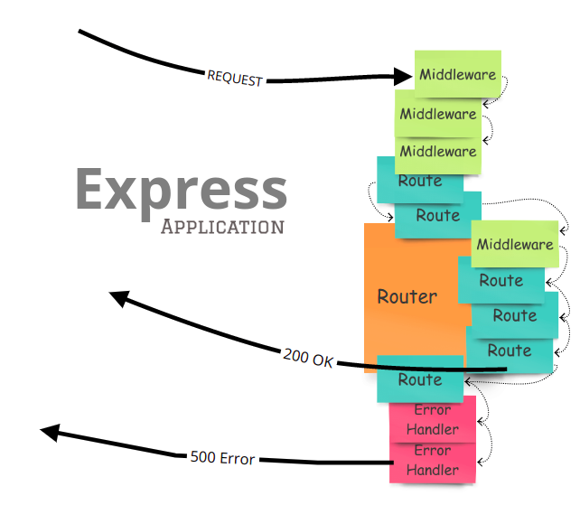

import { Alert } from "antd";
import { Callout } from "nextra-theme-docs";

# 에러 핸들링

백엔드 서버에서 최우선 순위는 우선 정확한 작업입니다. 정확한 작업이란, 항상 성공만을 의미하는 것은 아닙니다. 성공했을 때는 성공했다고 응답하고, 실패했을 때는 실패했다고 응답해야 합니다. 또한 실패했을 경우에는 왜 실패했는지 정확한 이유와 함께 응답해야 합니다.


<br/>

서버에서는 여러 가지 이유로 에러 핸들링이 필요할 수 있습니다. 클라이언트에서 잘못된 요청을 보냈을 경우, 그에 대한 핸들링이 필요할 수도 있고, 서버 자체적으로 예상치 못한 오류가 발생했을 경우 그에 대한 처리가 필요할 수도 있습니다.

<br/>

백엔드 작업에서 가장 중요한 부분이기도 한 에러 핸들링에 대해 알아보도록 하겠습니다.

<br/>
<br/>

## 기본적인 에러 핸들링

<br/>

Express에서 에러를 처리하는 가장 단순한 방법은 개별 라우팅 핸들러 함수에 에러 핸들링 로직을 추가하는 것입니다.

```js showLineNumbers copy
app.post("/products", async (req, res) => {
  try {
    const {
      name,
      category,
      quantity
    } = req.body.product;

    if (!name || !category || !quantity) {
      throw new Error();
    }

    const product = new Product({ name, category, quantity });

    await product.save();

    res.json(product);
  } catch (error) {
    res.status(400).json({ message: "invalid product data" });
  }
});
```

이와 같이 개별 라우팅 핸들러에 에러 핸들링 로직을 추가하는 것은 에러 핸들링 로직이 분산되고 파편화 되어 있기 때문에, 일관된 에러 핸들링 로직을 유지보수하기 어렵습니다. 그렇기에 Express에서는 이를 보완할 수 있는 방안을 제공합니다.
<br/>
<br/>

## Express 에러 핸들러

<br/>

Express의 모든 라우팅 핸들러에서 발생하는 오류들을 아래와 같이 커스텀 에러 핸들러를 선언하여 한 곳에서 관리할 수 있습니다. 에러 핸들러 위에 위치한 모든 라우팅 핸들러의 에러는 우리가 선언한 에러 핸들러에서 처리가 가능합니다.

> [Express 에러 핸들러](https://expressjs.com/en/guide/error-handling.html)



```js showLineNumbers copy {8-11}
const express = require("express");
const app = express();

// route handlers
app.get(...);
app.post(...);

app.use((error, req, res, next) => {
  // custom error handling logic
  res.status(error.status).({ message: error.message });
});
```

라우팅 핸들러에서는 에러가 발생할 경우, 다음과 같이 `next` 함수를 이용하여 커스텀 에러 핸들러로 에러 핸들링을 위임시킬 수 있습니다.

```js showLineNumbers copy /next/ {10-12}
app.post("/products", async (req, res, next) => {
  try {
    const {
      name,
      category,
      quantity
    } = req.body.product;

    if (!name || !category || !quantity) {
      const error = new Error("invalid product data");
      error.status = 400;
      throw error;
    }

    const product = new Product({ name, category, quantity });

    await product.save();

    res.json(product);
  } catch (error) {
    next(error);
  }
});
```

<br />
<br />

## 에러 추상화 하기

<br />

에러 메시지, 상태 코드 등을 더욱 효율적으로 다루고 에러를 더욱 잘 제어하기 위해 우리는 객체 지향적으로 접근해볼 수도 있습니다.

> 코드에 정답은 없습니다. 참고만 하세요.

```js showLineNumbers copy
class MyCustomError extends Error {
  constructor(statusCode, message) {
    super(message);
    this.statusCode = statusCode;
    this.timestamp = new Date().toISOString();

    Error.captureStackTrace(this, this.constructor);
  }
}
```

<br />

> [`Error.captureStackTrace`](https://nodejs.org/api/errors.html#errorcapturestacktracetargetobject-constructoropt)란, 에러 스택 트레이스에 대한 기록을 남겨주는 Node.js 메소드입니다.

<br />

위와 같은 클래스를 우리는 아래와 같이 사용할 수 있습니다.

```js showLineNumbers copy {10-13}
app.post("/products", async (req, res, next) => {
  try {
    const {
      name,
      category,
      quantity
    } = req.body.product;

    if (!name || !category || !quantity) {
      throw new MyCustomError(
        400,
        "invalid product data"
      );
    }

    const product = new Product({ name, category, quantity });

    await product.save();

    res.json(product);
  } catch (error) {
    next(error);
  }
});
```

위에서 보여드린 예시에서 더욱 발전하여 현업에서 에러를 다루는 방식과 방법은 상당히 다양해질 수 있습니다. 아직은 많은 패턴을 보고 경험하지 못했지만, 여러분께서는 우선 어떤 상황에 어떤 에러들이 발생하고 어떻게 처리해야 하는지에 대해 집중하고 에러 처리를 정확하게 할 수 있도록 연습하면 좋을것 같습니다.
