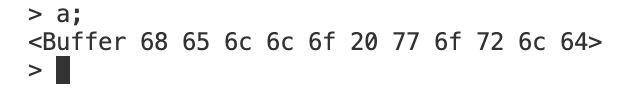
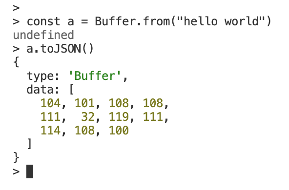

import { Alert } from "antd";
import { Callout } from "nextra-theme-docs";

# 버퍼와 스트림


버퍼와 스트림은 매일 디테일하게 다루게 되는 부분은 아니지만, Node.js로 작업하는 모든 개발자가 반드시 알아야 하는 필수적인 개념입니다. 버퍼와 스트림을 이해하는 것은 Node.js에서 메모리를 효율적으로 사용하며 데이터를 처리하는데 있어 가장 기초가 되는 일입니다.

안타깝게도 많은 Node.js 강의들이 버퍼와 스트림에 대해 다루지 않고, 단순히 백엔드 서버를 구축하는 직접적인 방법에만 집중하는 경우가 대부분입니다. 앞서 말했듯이, 버퍼와 스트림은 매일 개발 작업을 하며 직접적으로 다루게 되는 경우가 드물기 때문에 많은 강의들이 그런 선택을 했다고 생각되고 제가 교육받았던 교육기관 또한 버퍼와 스트림에 대해 교육하지 않았습니다. 하지만 제가 Node.js 기술스택을 사용하는 백엔드 개발자로 근무를 할 당시에 깨달았던 가장 중요한 사실 중 하나는, 프론트엔드에서 Web API와 DOM을 이해하는 것이 중요한 만큼 백엔드에서는 버퍼와 스트림을 이해하는 것이 핵심이라는 사실입니다.

그렇기에 여러분께서 단지 백엔드 서버를 구축하고 업무를 하는데는 지장이 없을 수 있지만, 조금 더 이해도가 뛰어난 개발자가 되기 위해서는 버퍼와 스트림에 대한 탄탄한 지식은 필수적입니다.

<br />
<br />

## 버퍼

<br />

Node.js 작업 중, 콘솔창에서 아래와 유사한 메시지를 목격한 경험이 있으신가요? 아래 이미지 속 출력물이 바로 버퍼라는 것인데, 버퍼란 무엇인지 한번 알아보도록 하겠습니다.



<br />

### 컴퓨터 공학 측면에서의 버퍼

컴퓨터 공학에서 말하는 버퍼란, 임시 데이터를 저장하는 컴퓨터의 물리적인 메모리 공간을 의미합니다.

<br />

### Node.js 버퍼

Node.js에서의 버퍼란, V8 자바스크립트 엔진 외부 공간에 할당되는 메모리 공간을 의미합니다. Node.js 버퍼는 정수들의 순열(sequence of integers)을 저장합니다. Node.js 버퍼는 보통 자바스크립트 배열과 유사한 모습을 갖지만, 배열과는 다르게 한번 결정된 사이즈가 변경될 수는 없다는 부분이 배열과의 차이점입니다. Node.js 버퍼는 로우 바이너리 데이터(raw binary data)를 다루기 위해 만들어졌습니다.



<br />

### 버퍼의 목적

백엔드 어플리케이션이 구동되는 과정에서 수 많은 데이터의 이동이 발생합니다. 데이터가 이동하는 것은 여러가지 상황에 따라 다양한 목적을 위해 발생합니다. 하지만 컴퓨터가 데이터를 처리하는데는 일정 시간이 소요될 수 밖에 없습니다.

만약 준비된 데이터를 처리하는데 소요되는 시간보다 데이터가 이동하고 도착하는 시간이 빠르다면, 일정양의 데이터는 대기할 수 밖에 없습니다.

반대로 만약 데이터를 처리하는 시간이 데이터가 도착하는 시간보다 빠르다면, 먼저 도착한 데이터는 추가로 필요한 데이터가 도착할때까지 대기할 수 밖에 없습니다.

이런 대기 공간이 버퍼입니다. 앞서 말씀드린 것처럼 임시 데이터를 저장하는 컴퓨터의 물리적인 메모리 공간이며, Node.js에서는 자바스크립트 엔진 외부에 존재하는 메모리 공간입니다.

<br />
<br />

## 스트림

<br />

스트림이란, 많은 양의 데이터를 효율적인 방법으로 이동시키는 방법입니다. 파일이나 네트워크 통신을 효율적으로 다룰때 주로 적용되는 방식이며, 유튜브와 같은 영상 플레이어와 같이 우리의 일상 생활에서도 많이 접할 수 있는 방식입니다.

유튜브 같은 서비스를 이용할때, 한번에 모든 영상이 활성화되지 않고 초반 도입부부터 조금씩 활성화 되는 것을 확인할 수 있습니다. 이렇게 일부분씩 필요한 만큼 조각내어 처리하는 방식을 스트림이라고 합니다.

이전 과제의 일부에서 아래와 유사한 코드를 작성해봤던 것을 기억하실까요?

```js showLineNumbers copy
let body = "";

req.on("data", (chunk) => {
  body += chunk;
});

req.on("end", () => {
  // body 완성.
  console.log(body);
});
```

위의 예시에서 보면, `chunk`라는 조각을 이어 붙이는 것을 볼 수 있습니다. 그 이유는, 요청 데이터가 스트림 방식으로 끊어져 들어오기 때문이었습니다.

추상화가 되어있는 Express를 사용한다면 위와 같은 코드는 직접적으로 사용할 일이 없지만, 근본적인 Node.js를 이해하기 위해서는 위와 같은 코드가 스트림 기반이라는 것을 알아볼 수 있어야 합니다.

<br />
<br />

## 버퍼와 스트림 - 버스와 승객들

<br />


<br />

버퍼와 스트림은 아주 밀접한 관계가 있습니다. 우리가 인터넷으로 영상을 시청할때, 버퍼링 과정을 거쳐서 스트리밍 영상을 보는 것과 동일합니다. 일반적으로 버퍼와 스트림은 버스 시스템에 흔히 비유하곤 합니다.

버스는 일정 인원 이상의 승객들이 도착할때까지 혹은 약속한 출발 시간이 될때까지 출발할 수 없는 경우가 있습니다. 또한 승객들은 각각 다른 시간에 다른 속도로 도착하기도 합니다. 버스 정류장이나 각각의 승객들 그 누구도 다른 승객들의 도착시간에 대해 컨트롤할 수 있는 방법은 없습니다.

일찍 도착한 승객들은 버스 정류장에서 버스가 도착하기를 기다려야 할 수도 있고, 버스가 이미 꽉 찬 상태에서 버스 정류장에 도착한 승객이나 이미 버스가 떠난 이후에 버스 정류장에 도착한 승객은 다음 버스를 기다려야 할 수 있습니다.

어떤 상황이건, 대기 공간이라는 개념은 반드시 필요하고 그에 해당하는 공간은 버퍼입니다. 버스가 이동시키는 승객의 흐름은 스트림이라고 생각할 수 있습니다.
