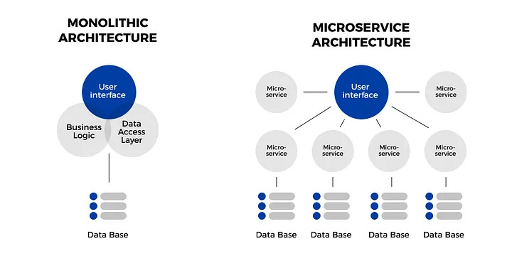

import { Alert } from "antd";
import { Callout } from "nextra-theme-docs";

# 백엔드 구조

우리가 현재 학습하는 기술 스택은 MERN 스택이라고 부를 수 있습니다. MERN 스택이란, Mongo + Express + React + Node의 축약어입니다.

물론 우리는 MERN 스택을 학습하지만, 기술 스택과는 관계없이 백엔드 서비스는 상황에 따라 구조적으로 다르게 설계할 수 있습니다. Monolith(모노리스)와 Microservice(마이크로서비스) 아키텍쳐가 대표적인 두 가지 방식입니다. 이 두 가지 아키텍쳐 방식에 대해 알아보도록 하겠습니다.

 
 

## 모노리스와 마이크로서비스

모노리스 아키텍쳐는 매우 전통적인 소프트웨어 개발 아키텍쳐입니다. 하나의 코드 베이스에서 우리의 서비스와 연관된 여러가지 기능들을 모두 수행하도록 작업하는 방식을 의미합니다. 구체적인 장단점은 잠시 후에 다시 언급하겠지만, 모노리스 방식은 일반적으로 각기 다른 개발 파트 간의 의존성이 하나의 코드 베이스에 존재하기 때문에 구조적 수정사항을 반영하기 위해서는 시간이 많이 소요되고 제약사항도 많은 편입니다.

반대로, 마이크로서비스 아키텍쳐는 관련 도메인이나 기능 등에 따라 독립적인 작은 단위로 나누어 관리하고 유지보수하는 방식입니다. 작은 단위의 각 서비스는 명확한 하나의 목적에 집중하고, 다른 서비스들과 데이터 교환을 통해 필요한 의존성을 해결합니다. 각 서비스는 독립적인 코드 베이스로 관리되기 때문에, 수정이나 배포 또한 개별적으로 운영됩니다.

 

### 주요 차이점

모노리스 웹 어플리케이션은 일반적으로 프론트엔드, 백엔드를 통합한 구조로서, 관련 개발자들은 모두 하나의 코드 베이스에서 작업을 합니다. 반면에, 마이크로서비스 아키텍쳐를 취하는 방식은 프론트엔드, 그리고 백엔드가 우선 나뉘어 지는 편이고, 백엔드 내에서도 각기 세부 도메인이나 기능에 따라 모듈을 나누어 하나의 서비스를 구성하게 됩니다. 그리고 프론트엔드, 각 백엔드 모듈들은 API를 통해 필요한 데이터를 전달하고 전달받습니다.

 

#### 1. 개발 프로세스

모노리스 어플리케이션은 단순한 구조이기 때문에 상대적으로 훨씬 구축이 간편하고 용이하며, 작은 규모의 팀이라도 손쉽게 프로덕트를 만들고 빠른 시간 안에 시장에 나갈 수 있도록 초반 작업시간을 절약할 수 있습니다. 그렇지만, 만약 서비스가 지속적으로 성장한다면 많은 기능과 로직이 하나의 코드 베이스에 존재하게 되므로 장기적인 측면에서는 부작용들이 발생할 수 있습니다.

하지만, 마이크로서비스 기반의 어플리케이션은 상대적으로 복잡합니다. 서비스를 구성하는 각 모듈의 버전관리나 유지보수 등을 독립적으로 운영해야 하기 때문에, 팀내 문서화나 의사소통에 대한 비용이 증가할 수 있습니다. 그렇기에 작은 규모의 팀에는 적합한 선택이 아닐 수 있고, 어느 정도 규모가 있고 서비스가 안정화 된 상황에 적합한 선택일 수 있습니다.

 

#### 2. 배포

모노리스 어플리케이션의 배포는 매우 직관적이고 단순합니다. 하나의 프로젝트에 대한 배포 파이프라인(Continuous Deployment) 등을 구축하고, 필요한 환경(개발, 프로덕션 등)을 갖추는 것이 전부입니다.

마이크로서비스 어플리케이션은 여러 개의 프로젝트로 나뉘어 운영되는 구조이기 때문에, 각각의 모듈에 대한 배포 설정, 환경 설정 등이 개별적으로 구축되어야 합니다. 이런 마이크로서비스를 운영하는 상황에서 각각의 독립적인 모듈이 효율적으로 운영되기 위해서 Docker나 Kubernetes 등의 서비스를 사용하기도 합니다.

> 배포나 이와 관련된 환경 설정에 대한 영역은 기업 상황에 따라 백엔드 개발자의 영역이기도 하지만, 규모가 큰 조직에서는 Dev-ops의 영역이 되기도 합니다. 규모가 큰 조직이라는건 큰 기업을 의미하는 것은 아닙니다. 큰 기업에서도 조직은 작게 운영될 수 있고, 작은 기업에서도 조직이 큰 규모로 운영될 수 있습니다.

 

#### 3. 디버깅

디버깅이란, 우리 서비스에서 발생하는 이슈에 대한 코드상 오류를 찾아가는 과정을 뜻합니다. 모노리스 어플리케이션을 디버깅할때, 개발자들은 데이터의 흐름이나 코드의 동작을 하나의 독립된 환경 내에서 재현하고 추적합니다. 그렇기에 모노리스 어플리케이션은 디버깅이 단순합니다. 하지만 마이크로서비스는 여러 개의 모듈로 나뉘어 있는만큼, 디버깅은 복잡하고 어려울 수 밖에 없습니다.

마이크로서비스는 보통 각각의 모듈을 전담하는 팀원들이 있고, 디버깅이 필요한 상황에는 여러 명의 연관된 팀원들이 긴밀하게 소통하며 많은 시간과 리소스를 투자해야 합니다.

 

#### 4. 기능 수정

앞서 말했듯이, 모노리스 어플리케이션에서는 하나의 코드 베이스에서 운영되기에 작은 수정이라 하더라도 우리 서비스의 (예상치 못한) 다른 부분들에 영향을 줄 수 있습니다. 그리고 새로운 기능개발이나 버그수정 등이 안정적으로 배포되기 위해서는 전체 시스템이 면밀하게 테스트 되어야 하며 다시 배포되어야 합니다.

마이크로서비스는 그에 비해 매우 유연합니다. 모든 파트가 독립적이기 때문에, 개별적인 기능개발이나 버그수정 등이 작업될 수 있으며 테스트나 배포 또한 독립적으로 진행될 수 있습니다.

 

#### 5. 스케일링

모노리스 어플리케이션은 스케일링에 있어 매우 제한적인 측면을 보이는 편입니다. 스케일링과 관련된 성능적인 개선 등이 모두 하나의 코드 베이스에서 전체적으로 동시에 이루어질 수 밖에 없는 구조이기 때문에, 상황에 따라서는 자원이 낭비될 수 있는 여지도 있습니다.

마이크로서비스는 독립적으로 운영되기 때문에 성능적 개선이 필요한 모듈에 제한적으로 관련 환경설정을 변경할 수 있고, 분산시스템을 도입하는 등 운영방식에 대한 조정을 할 수 있습니다.

 

### 적절한 선택 기준

모노리스 구조와 마이크로서비스 구조 모두 많은 개발자들이 선택하는 아키텍쳐입니다. 개발자로서 각각의 장단점을 알고 본인에게 주어진 상황에 따라 최선의 선택을 할 수 있는 능력을 기르는 것이 중요합니다. 그렇다면, 어떤 기준들이 있을까요?

> 아래에서 언급하는 기준들은 일반적으로 생각하는 기준들입니다. 상황에 따라 많은 다양한 케이스가 있을 수 있으므로, 일반화하여 생각하지 마세요.

 

#### 1. 어플리케이션의 규모

모노리스 어플리케이션은 조금 더 단순한 초기 단계의 프로덕트에 적합한 편입니다. 빠르게 개발이 가능하고, 유지보수 측면에서 적은 인력으로도 운영이 수월합니다.

마이크로서비스는 복잡한 수준의 시스템을 구축하는데 더욱 적합합니다. 장기적으로 기능개발이나 스케일링에 있어 독립적인 성장성과 유연함을 보장하기 때문에, 복잡한 시스템이지만 유지보수가 수월해지는 측면이 많습니다.

 

#### 2. 팀의 경쟁력

앞서 말한 유연함과 수 많은 장점에도 불구하고, 마이크로서비스는 작업과정에 있어 더 많은 관련 지식과 소프트웨어 디자인 측면에서의 고민이 필요합니다. 또한 모노리스 어플리케이션에 비해 더욱 많은 클라우드 아키텍쳐, API, 컨테이너 등의 전문 지식들을 필요로 하는 상황이 많습니다. 디버깅 또한 훨씬 복잡한 과정과 구조를 갖고 있기도 합니다. 그말인 즉슨, 이런 마이크로서비스를 다루는 개발자들은 상대적으로 더 많은 기술적 챌린지와 새로운 지식의 학습을 빠르게 경험하고 이겨낼 수 있는 능력이 있어야 합니다.

 

#### 3. 인프라스트럭쳐

모노리스 어플리케이션은 보통 단일 서버로 구축되어 실행되지만, 마이크로서비스는 일반적으로 스케일링이나 기타 설정이 유연한 클라우드 환경에 구축되는 편입니다. 물론 모노리스 어플리케이션도 클라우드 환경에 구축될 수 있으며, 마이크로서비스도 단순하게 인프라를 설계할 수 있습니다. 실제로도 최근에는 클라우드 환경이 발전함에 따라, 모노리스 어플리케이션 또한 대부분 클라우드 환경을 선호하는 편입니다.

 

### 마무리

구조에 대한 정답은 없습니다. 최선의 선택이 무엇인지는 항상 상황에 따라 다르고, 팀에 따라 다릅니다. 우리는 그 선택을 할 수 있는 사고능력을 몸에 습관처럼 익히고 있어야 합니다.
