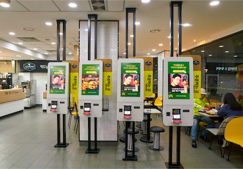
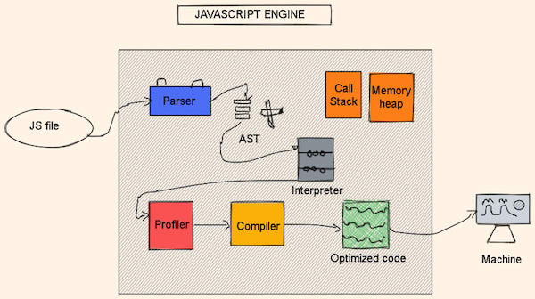
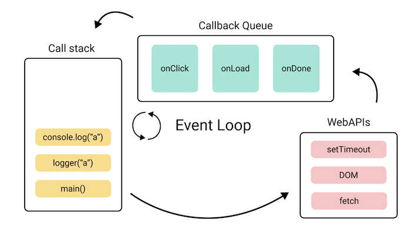

import { Alert, Collapse, Rate, Button, Result, Typography } from "antd";
import { SnippetsTwoTone, QuestionCircleTwoTone } from "@ant-design/icons";
import { red, green } from "@ant-design/colors";

# 비동기 프로그래밍

## 기본 개념

<Rate disabled={true} value={5} />
<br />
<br />

프로그래밍에는 비동기라는 코드의 동작 흐름에 대한 개념이 있습니다. 개발자라면, 누구나 숨 쉬듯이 사용하는 매우 중요한 개념입니다. 우선 비유를 들어 대략적인 개념을 설명해보도록 하겠습니다.

<br />
<br />

### 비동기 시스템



비동기 시스템을 설명할때 가장 흔히 비유하는 상황은 맥도날드 같은 곳의 주문 시스템입니다. 맥도날드의 주문 체계는 다음과 같습니다.

1. 음식을 주문하기 위해 계산대 **대기열에 줄을 서고**, 순서를 기다립니다.
2. 순서가 되면, 음식을 주문하고 계산을 합니다.
3. 주문 번호를 받고 **대기열에서 나와** 자리를 잡고 음식이 나오기를 기다립니다.
4. 우리 뒤에 대기하던 고객들 또한 순서대로 음식을 주문합니다.
5. 일정 시간이 지난 뒤, 우리가 주문한 음식이 준비되면 음식을 받습니다.

> 먼저 주문한 고객이 반드시 먼저 음식을 받는다는 보장은 없습니다. 주문한 음식의 종류나 양에 따라, 식당 주방 사정에 따라 음식을 주문한 순서와 받는 순서는 다를 수 있습니다.

위와 같은 체계가 비동기 방식의 흐름이라고 할 수 있습니다. (실제 코드에서는 조금 다르겠지만) 우선 개념 자체는 간단하죠?

<br />
<br />

### 동기 시스템

비동기의 반대되는 개념인 동기적인 시스템을 위와 동일한 상황에 비유하여 생각해본다면 아래와 같습니다.

1. 음식을 주문하기 위해 계산대 **대기열에 줄을 서고**, 순서를 기다립니다.
2. 순서가 되면, 음식을 주문하고 계산을 합니다.
3. 계산 후, **주문한 음식이 나올때까지 대기열에서 계속 대기합니다.**
4. 우리 뒤에 대기하던 고객들은 주문하지 못하고 계속 대기합니다.
5. 일정 시간이 지난 뒤, 우리가 **주문한 음식이 준비되면 음식을 받고 대기열에서 나와** 자리를 잡고 식사를 합니다.
6. 우리 뒤에 대기하던 고객들이 음식을 주문합니다.

이와 같은 체계가 동기 체계라고 할 수 있습니다.

<br />
<br />

### 개념 정리

현재 비유한 상황에 대해 생각해보자면, 마치 동기 시스템이 매우 비효율적인 것처럼 표현된 경향이 있는것 같습니다. **항상 비동기 방식이 효율적이고, 동기 방식은 비효율적일까요?** 상황에 따른 적합도가 다를것 같습니다.

시간이 상대적으로 많이 소요되는 작업의 경우에는 비동기 방식이 효율적일 수 있고, 시간이 크게 소요되지 않는 작업의 경우에는 오히려 비동기 방식은 비효율적일 수 있기에 동기 방식이 더욱 적합할 수 있습니다.

프로그래밍에서도 마찬가지입니다. 시간이 다소 소요되는 작업의 경우에는 비동기 방식을 선호하는 경향이 있고, 일반적인 경우에는 디버깅이 용이하고 흐름 파악이 직관적인 동기 방식이 기본적으로 선호됩니다.

<br />
<br />

## 비동기 메커니즘

<Rate disabled={true} value={5} />
<br />
<br />

##### 예시 1.

우리가 작성하는 모든 코드는 기본적으로 동기 방식입니다. 우선 동기 방식의 코드 흐름을 다시 한번 살펴보겠습니다.

```js showLineNumbers copy
function multiply(a, b) {
  return a * b;
}

function square(n) {
  return multiply(n, n);
}

const result = square(2);
console.log(result);
```

<br />
<Collapse>
  <Collapse.Panel header="[텍스트 설명] 위의 예시 코드는 이런 흐름으로 실행됩니다. 1분 정도 생각해보시고, 열어보세요.">
    <p>
      1. 1번째 줄에서 `multiply` 함수를 선언(생성)합니다.
      2. 5번째 줄에서 `square` 함수를 선언(생성)합니다.
      3. 9번째 줄에서 `square(2);{:js}` 함수 실행문을 실행합니다.
      4. `square` 함수에 2가 인자로 대입되어 실행됐기 때문에, 6번째 줄이 실행됩니다.
      5. 6번째 줄의 `return multiply(2, 2);{:js}` 구문이 실행되는데, `multiply(2, 2);{:js}` 구문이 먼저 실행되고 결과값이 나와야 `return{:js}` 할 수 있기 때문에 `multiply` 함수가 실행됩니다.
      6. 2번째 줄의 `return 2 * 2;{:js}` 구문이 실행되고, 4라는 결과가 반환됩니다.
      7. 6번째 줄의 `multiply(2, 2);{:js}` 구문의 결과가 4라고 나왔기 때문에, 6번째 줄의 `return multiply(2, 2);{:js}` 구문은 결과적으로 `return 4;{:js}`가 되어 실행됩니다.
      8. 9번째 줄의 `square(2);{:js}` 구문의 결과로 4가 반환되었기 때문에, 9번째 줄의 `const result = square(2);{:js}` 구문은 결과적으로 `const result = 4;{:js}`가 됩니다.
      9. 10번째 줄의 콘솔 출력문은 4라는 값을 출력합니다.

      현재 코드의 흐름은 동기 방식입니다. 앞 단계 작업이 종료되어야 그 후속 작업이 진행될 수 있습니다. 일반적으로 우리가 알고 있는 코드의 실행 흐름이라고 할 수 있습니다.
    </p>

  </Collapse.Panel>
</Collapse>

<br />
<Collapse>
  <Collapse.Panel header="[영상 설명] 위의 예시 코드는 이런 흐름으로 실행됩니다. 1분 정도 생각해보시고, 열어보세요.">
    <p>
      100% 동일한 코드는 아닙니다. 그리고 Sorry, 알러지 때문에 선글라스 비디오
      필터를 사용했습니다.
      <br />
      <iframe
        src="https://player.vimeo.com/video/824318743?h=277a6bd757"
        width="640"
        height="360"
        frameborder="0"
        allow="autoplay; fullscreen; picture-in-picture"
        allowfullscreen
      ></iframe>
    </p>
  </Collapse.Panel>
</Collapse>

<br />
<br />

##### 예시 2.

이번에는 비동기 코드의 예시를 보여드리겠습니다. 여러분의 호기심과 이목을 집중시키기 위해 최대한 충격적인 예시를 만들어보았습니다.

```js showLineNumbers copy
function multiply(a, b) {
  return a * b;
}

function square(n) {
  return multiply(n, n);
}

setTimeout(function foo() {
  const result = square(2);
  console.log(`비동기 결과: ${result}`);
}, 0);

for (let i = 1; i <= 1000; i++) {
  const result = square(i);
  console.log(`${i}번째 동기 결과: ${result}`);
}
```

<br />
<Collapse>
  <Collapse.Panel header="위의 예시 코드를 실행하면 콘솔 출력문들의 출력 순서는 어떻게 될까요? 코드 내용을 자세히 읽어본 후, 열어보세요.">
    <p>
      위의 예시 코드를 실행하면, "비동기 결과: 4"가 가장 마지막에 콘솔창에 출력됩니다. 비동기 메커니즘을 잘 이해한 사람이라면, 당연히 예측할 수 있는 코드의 실행 흐름입니다.

      여러분께는 아직 조금 낯설 수 있겠지만, 지금부터 딱 1시간만 집중하시면 충분히 이해하실 수 있는 부분입니다.

      이런 비동기 메커니즘을 이해하려면, 비동기 메커니즘과 관련된 브라우저의 구성 요소에 대해 우선적으로 알아야 합니다. 하나씩 차근차근 알아보고 다시 이 예시 코드를 돌아보도록 하겠습니다.
    </p>

  </Collapse.Panel>
</Collapse>

> [`setTimeout`](https://developer.mozilla.org/ko/docs/Web/API/setTimeout) 함수는 2개의 인자를 받습니다. 첫 번째 인자는 함수, 두 번째 인자는 숫자를 받습니다. 두 번째 인자로 주어진 숫자는 시간 값으로 사용되어, 해당 시간이 지난 후 첫 번째 인자로 주어진 함수를 실행되도록 합니다.

<br />
<br />

## 브라우저 구성 요소

<Rate disabled={true} value={5} />
<br />
<br />

우선 비동기 메커니즘과 관련된 브라우저의 구성 요소에 대해 알아보겠습니다.

<br />
<br />

### 자바스크립트 엔진

자바스크립트 엔진이란, 자바스크립트를 실행하기 위한 소프트웨어입니다. 자바스크립트 엔진은 자바스크립트 문법을 이해하고 실행할 수 있는 능력을 갖추고 있습니다. 대표적으로 [크롬의 V8](https://v8.dev/)같은 소프트웨어가 있습니다.



자바스크립트 엔진은 매우 복잡한 구조로 이루어져 있습니다. 예전에 참조값에 대한 설명을 할때 비유적으로 사용했던 서랍장과 같은 역할을 하는 Memory Heap도 있고, 자바스크립트 문법을 독해하는 Parser나 AST같은 프로그램도 존재합니다.

하지만 자바스크립트 엔진의 여러 부분 중, 여러분께서 지금 반드시 알아야 할 부분은 **콜 스택**입니다.

<br />
<br />

#### 콜 스택

콜 스택은 여러 함수를 호출하는 상황에서 해당 위치를 추적하는 자바스크립트 엔진을 위한 메커니즘입니다. 현재 어떤 함수가 동작하고 있는지, 그 함수 내에서 어떤 함수가 호출되는지, 다음에 어떤 함수가 호출되어야 하는지 등을 추적합니다.

콜 스택은 아래와 같은 규칙으로 제어됩니다.

- 어떤 함수(A)가 호출될 경우, 해당 함수(A)가 콜 스택에 쌓인다.
- 해당 함수(A)가 종료되기 전에 다른 함수(B)가 호출된다면 기존 함수(A) 위에 새로 호출된 함수(B)가 쌓인다.
- 현재 함수의 실행이 종료될 경우, 종료된 함수는 콜 스택에서 제거되고 그 아래에 쌓여있던 함수의 실행이 재개된다.

<br />
<Collapse>
  <Collapse.Panel header="스택 자료구조란?">
    <p>
      스택(Stack)이라 하면, 자료구조의 한 종류입니다. 책을 위로 쌓아올리듯 구성되는 자료구조입니다.

      

      스택 구조는 새로운 자료를 위에 쌓고, 가장 위에 쌓인 자료를 꺼내야 하는 방식입니다. 그렇기에 **First In, Last Out (선입후출) 방식**으로 자료가 들어가고 나가게 됩니다.
    </p>

  </Collapse.Panel>
</Collapse>

<br />
<br />

### Web API

자바스크립트는 흔히 브라우저에서 사용하기에 웹 브라우저와 밀접하게 기능의 경계를 허물고 교류하고 있습니다. 그렇기에 초보자들은 구분짓기 어렵지만, 초보자들이 자바스크립트라고 믿고 있는 기능 중에는 사실 자바스크립트가 아닌 것들이 많이 있습니다.

<br />
<Collapse>
  <Collapse.Panel header="진짜 자바스크립트를 쉽게 판별하는 방법">
    <p>
      알고리즘 문제 풀이 하고 계시죠? 알고리즘 문제를 풀때 사용할 수 있는 기능들은 99.9% 순수 자바스크립트 문법들이라고 볼 수 있습니다.

      (0.1% 정도의 예외가 있기는 합니다.)
    </p>

  </Collapse.Panel>
</Collapse>

기본적으로 브라우저의 글로벌 객체인 `window` 객체에 포함되어 제공되는 모든 것은 Web API의 일부라고 볼 수 있습니다. 브라우저의 개발자 도구를 열어서 아래 코드들을 한번 입력해보세요.

```js copy
window.document;
```

```js copy
window.setTimeout(function () {
  console.log("hello world");
}, 10);
```

```js copy
window.console.log("hello world");
```

여러분이 사용했던 `document`, `setTimeout`, `console`과 같은 것들은 사실 자바스크립트가 아닌 Web API라고 불리는 부분입니다. 브라우저라는 환경에서 웹 페이지를 다루는 자바스크립트 언어의 특성을 고려하여, 브라우저를 만드는 회사들에서 웹 페이지를 더욱 쉽게 다루는 환경을 제공하기 위한 기능들이라고 볼 수 있습니다.

> 어떤 것들이 Web API고, 어떤 것들이 진짜 자바스크립트인지 지금 당장 확실하게 구분짓지 못해도 괜찮습니다. 앞으로 자연스럽게 구별할 수 있게 될 것이니, 여러분이 사용하는 함수나 기능에 대해 그때 그때 자세히 조사해보도록 하세요.

<br />
<br />

### 콜백 큐

**콜백 큐란, 함수들이 줄을 서게 되는 구조**입니다. 그리고 먼저 줄을 선 함수가 먼저 처리되고, 나중에 줄을 선 함수가 나중에 처리됩니다.

콜백 큐에는 비동기 방식으로 실행되어야 하는 함수들이 실행되기 전에 잠시 대기하는 대기열 공간입니다. 이 대기열에 대기하는 함수들은 하나씩 실행되어 콜 스택에서 처리됩니다.

<br />
<Collapse>
  <Collapse.Panel header="큐 자료구조란?">
    <p>
      큐(Queue)라 하면, 자료구조의 한 종류입니다. 사람들이 계산대에 줄을 서듯 구성되는 자료구조입니다.

      

      큐 구조는 먼저 대기열에 선 자료가 먼저 나올 수 있고, 나중에 대기열에 선 자료가 나중에 나올 수 있는 방식입니다. 그렇기에 **First In, First Out (선입선출) 방식**으로 자료가 들어가고 나가게 됩니다.
    </p>

  </Collapse.Panel>
</Collapse>

그렇다면, 콜백 큐라는 구조에서 대기하는 함수들은 어떤 규칙에 의해서 실행되는 것일까요?

<br />
<br />

### 이벤트 룹

이벤트 룹이란, 위에 언급되었던 Web API, 자바스크립트 콜 스택, 콜백 큐 등이 서로 각자의 업무에 열중하는 동안 각 파트에서 발생하는 **사건(이벤트)** 에 대해 주의를 기울이고 모니터링하다가 다른 파트와 연결되어야 하는 접점이 있다면 연결지어 주는 중간 관리자와 같은 역할을 **반복적**으로 하는 매커니즘입니다.

이벤트 룹이라는 메커니즘은 매우 다양한 역할을 맡고 있습니다. 기본적으로 브라우저의 비동기 렌더링 사이클, 자바스크립트 비동기 실행 사이클을 전반적으로 모니터링 하며 어떤 작업이 현재 실행되는 것이 좋을지 판단하고 순번을 결정합니다.



- 현재 콜 스택이 비어 있는 상태(실행 중인 자바스크립트가 없는 상태)이고 콜백 큐 대기열에서 대기하고 있는 함수가 있다면, 대기열 가장 앞에 위치한 함수를 콜 스택으로 이동시켜 실행될 수 있도록 합니다.
- 이동시켜 실행한 함수가 종료되어 더 이상 실행 중인 자바스크립트가 없는 상태이고 콜백 큐 대기열에서 대기하고 있는 함수가 있다면, 대기열 가장 앞에 위치한 함수를 콜 스택으로 이동시켜 실행될 수 있도록 합니다.
- 이벤트 룹은 이 과정을 반복적으로 진행합니다.

> 이벤트 룹은 브라우저의 비동기 렌더링 사이클 등 생각보다 많은 부분에서 관여합니다만, 지금 현재로서는 위에서 언급한 내용 정도를 우선적으로 이해해보도록 하세요.

글로만 봐서는 이해가 잘 안되시죠?

<br />
<br />

##### 예시 3.

비동기 로직이 담겨있는 코드의 실행 흐름을 콜 스택, Web API, 콜백 큐, 이벤트 룹 등의 개념과 연관지어 이해해보도록 하겠습니다.

```js showLineNumbers copy
function multiply(a, b) {
  return a * b;
}

function square(n) {
  return multiply(n, n);
}

console.log("start");

setTimeout(function doSomething() {
  const result = square(2);
  console.log(result);
}, 1000);

console.log("end");
```

<br />
<Collapse>
  <Collapse.Panel header="예시 코드에 대한 텍스트 설명">
    <p>
      1. 1번째 줄에서 `multiply` 함수를 선언(생성)합니다.
      2. 5번째 줄에서 `square` 함수를 선언(생성)합니다.
      3. 9번째 줄에서 `console.log("start");{:js}` 구문이 실행됩니다.
      4. `console.log("start");{:js}` 구문은 함수 실행문이기 때문에 콜 스택 구조에 쌓입니다.
      5. `console.log("start");{:js}` 구문은 별도의 다른 함수를 호출하지 않고 바로 종료되기 때문에 콜 스택에서 바로 제거됩니다.
      6. 11번째 줄의 `setTimeout(doSomething, 1000);{:js}` 구문이 실행됩니다.
      7. `setTimeout(doSomething, 1000);{:js}` 구문은 함수 실행문이기 때문에 콜 스택 구조에 `setTimeout` 함수 호출문이 쌓입니다.
      8. `setTimeout(doSomething, 1000);{:js}` 구문은 Web API에게 `doSomething` 함수를 1000ms 후에 실행해야 한다는 정보를 전달하고 바로 종료됩니다. 즉, 콜 스택에서 `setTimeout` 함수 호출문이 제거됩니다. (이 시점부터 Web API는 1000ms를 재기 시작합니다.)
      9. 16번째 줄에서 `console.log("end");{:js}` 구문이 실행됩니다.
      10. `console.log("end");{:js}` 구문은 함수 실행문이기 때문에 콜 스택 구조에 쌓입니다.
      11. `console.log("end");{:js}` 구문은 별도의 다른 함수를 호출하지 않고 바로 종료되기 때문에 콜 스택에서 바로 제거됩니다.
      12. 일정 시간이 지난 후, 8번 단계에서 재고 있던 1000ms의 시간에 도달합니다.
      13. Web API는 `doSomething` 함수를 콜백 큐 대기열에 대기시킵니다.
      14. 이벤트 룹은 콜백 큐와 콜 스택을 상시 모니터링 중입니다.
      15. 현재 콜 스택에 더 이상 실행 중인 자바스크립트 코드가 없고, 콜백 큐에 `doSomething` 함수가 대기 중인 것을 이벤트 룹이 감지합니다.
      16. `doSomething` 함수가 실행되어 콜 스택에 쌓입니다.
      17. 나머지는 기존 동기 코드의 흐름과 동일합니다.
    </p>
  </Collapse.Panel>
</Collapse>

<br />
<Collapse>
  <Collapse.Panel header="예시 코드에 대한 영상 설명">
    <p>
      Sorry, 알러지 때문에 선글라스 비디오 필터를 사용했습니다.
      <br />
      <iframe
        src="https://player.vimeo.com/video/824318757?h=15a739b310"
        width="640"
        height="360"
        frameborder="0"
        allow="autoplay; fullscreen; picture-in-picture"
        allowfullscreen
      ></iframe>
    </p>
  </Collapse.Panel>
</Collapse>

<br />
<br />

##### 예시 2.

이전에 봤던 예시 코드를 다시 한번 살펴보도록 하겠습니다.

```js showLineNumbers copy
function multiply(a, b) {
  return a * b;
}

function square(n) {
  return multiply(n, n);
}

setTimeout(function foo() {
  const result = square(2);
  console.log(`비동기 결과: ${result}`);
}, 0);

for (let i = 1; i <= 1000; i++) {
  const result = square(i);
  console.log(`${i}번째 동기 결과: ${result}`);
}
```

<br />
<Collapse>
  <Collapse.Panel header="위의 예시 코드를 실행하면 콘솔 출력문들의 출력 순서는 어떻게 될까요? 코드 내용을 자세히 읽어본 후, 열어보세요.">
    <p>
      위의 예시 코드를 실행하면, "비동기 결과: 4"가 가장 마지막에 콘솔창에 출력된다고 이야기 했었습니다.

      지금 다시 보시면, 혹시 이해가 되시나요?

      그럴 수 밖에 없는 이유는, 콜백 큐 대기열에 대기하던 함수들은 현재 실행되고 있는 자바스크립트가 모두 종료되어 콜 스택이 휴식기에 접어든 이후에 이벤트 룹에 의해 실행될 수 있기 때문입니다.

      구체적으로 살펴보자면, 비동기로 실행되는 `foo` 함수는 (물론 매우 빠른 시간이겠지만) 0초 후에 콜백 큐 대기열에 대기하게 됩니다. 0초는 너무나도 빠른 시간이기에 아마 14-17번째 줄의 반복문이 끝나기도 전에 대기열에 입장하게 되겠죠?

      대기열에서 대기하는 비동기 함수가 있는 상황이지만, 현재 콜 스택이 여전히 14-17번째 줄의 반복문을 처리하느라 바쁜 상황입니다. 이 모든 동기 코드가 종료되어야 우리의 콜 스택은 잠정적으로 휴식기에 접어들 수 있고, 그래야만 이벤트 룹은 콜백 큐 대기열에 있는 `foo` 함수를 실행시켜 콜 스택으로 입장시킵니다.

      이런 이벤트 룹의 비동기 처리 메커니즘을 이해하고 예시 코드를 본다면, 당연하게도 "비동기 결과: 4"라는 콘솔 출력이 가장 마지막에 출력될 수 밖에 없다는 것을 확실하게 알 수 있습니다.
    </p>

  </Collapse.Panel>
</Collapse>

<br />
<br />

## 자바스크립트의 비동기 처리 패턴

자바스크립트에서 비동기를 처리하는 패턴에는 크게 세 가지가 있습니다.

1. 콜백 패턴
2. `Promise`
3. `async/await`

많은 초보자들이 1번에 대한 심도있는 이해없이, 3번부터 사용하는 경우가 많습니다. 3번은 2번에 기반하여 동작하는 기술이고, 2번은 1번에 기반하여 동작합니다. 물론 2번은 1번의 단점을 보완하고, 3번 또한 2번의 단점을 보완하는 측면이 있습니다.

하지만 이는 단순히 코드 몇줄 써보고 블로그 몇개 읽어보고 이해할 수 있는 내용이 결코 아닙니다. 예를 들어, 인터넷에 프로미스에 대해 검색해보면 콜백 지옥을 해결해주는 도우미로 묘사하는 사람들이 많습니다. 이는 완전히 잘못된 정보입니다. 동물원에 가서 동물 몇 마리 봤다고 자연을 이해하는 것은 아니듯 말이죠.

우리는 앞으로 잠시 동안 우선 콜백 패턴과 프러미스에 집중할 것입니다. 그리고 이 과정에서 제가 여러분께 부탁드리고 싶은 것은 현재 인터넷에 난무하는 트렌드에 연연하지 마시고, 우리의 진행 방향에 모든 것을 집중해주세요.

불편함을 진심으로 공감해본 사람 만이 신기술의 편리함에 대해 더욱 깊이있게 이해할 수 있는 것입니다. 단계적으로 차근 차근 배워가며, 우리는 한층 남다른 이해도를 가진 개발자가 될 것입니다.

<br />
<br />

## 추가 자료

1. [Event Loop Visualizer Web](http://latentflip.com/loupe/)

2. **"What the heck is the event loop anyway"** by _Philip Roberts at JSConf EU_

   <iframe
     width="560"
     height="315"
     src="https://www.youtube.com/embed/8aGhZQkoFbQ?start=1"
     title="YouTube video player"
     frameborder="0"
     allow="accelerometer; autoplay; clipboard-write; encrypted-media; gyroscope; picture-in-picture; web-share"
     allowfullscreen
   ></iframe>

3. **"In the loop"** by _Jake Archibald at JSConf Asia_

> 매우 중요한 내용이니, 취업 전에 시간 들여서 전체 영상 해석하시고 반드시 이해해보셔야 합니다.

<br />

<iframe
  width="560"
  height="315"
  src="https://www.youtube.com/embed/cCOL7MC4Pl0"
  title="YouTube video player"
  frameborder="0"
  allow="accelerometer; autoplay; clipboard-write; encrypted-media; gyroscope; picture-in-picture; web-share"
  allowfullscreen
></iframe>

> (자랑) 그리고 저도 이 컨퍼런스에 연사로 초청받았었습니다.<br/>
> (켄무룩) 하지만 컨퍼런스 일정 직전에 중요한 바코 수업 일정 때문에 취소해야 했습니다.<br/>
> 아래는 당시 JSConf Asia 홈페이지에 올라왔던 제 프로필.
>
> (또 자랑) JSConf Asia는 **세계에서 JSConf US 다음으로 큰 자바스크립트 관련 컨퍼런스**입니다.


여러분도 나중에 저축 많이 하셔서 세계적인 컨퍼런스 꼭 가보세요. 동기부여가 많이 됩니다.
