import { Alert, Collapse, Rate, Button, Result, Popover, Typography, Col, Row } from "antd";
import { SnippetsTwoTone, QuestionCircleTwoTone, SyncOutlined } from "@ant-design/icons";
import { red, green } from "@ant-design/colors";
import Stepper from "../../components/Stepper";
import Example31 from "../../components/MDX/recursion/3-1.mdx";
import Example32 from "../../components/MDX/recursion/3-2.mdx";
import Example33 from "../../components/MDX/recursion/3-3.mdx";
import Example34 from "../../components/MDX/recursion/3-4.mdx";
import Example35 from "../../components/MDX/recursion/3-5.mdx";
import Example36 from "../../components/MDX/recursion/3-6.mdx";
import Example37 from "../../components/MDX/recursion/3-7.mdx";
import Example38 from "../../components/MDX/recursion/3-8.mdx";
import Example41 from "../../components/MDX/recursion/4-1.mdx";
import Example42 from "../../components/MDX/recursion/4-2.mdx";
import Example43 from "../../components/MDX/recursion/4-3.mdx";
import Example44 from "../../components/MDX/recursion/4-4.mdx";
import Example45 from "../../components/MDX/recursion/4-5.mdx";
import Example46 from "../../components/MDX/recursion/4-6.mdx";
import Example47 from "../../components/MDX/recursion/4-7.mdx";
import Example48 from "../../components/MDX/recursion/4-8.mdx";
import Example49 from "../../components/MDX/recursion/4-9.mdx";
import Example410 from "../../components/MDX/recursion/4-10.mdx";
import Example411 from "../../components/MDX/recursion/4-11.mdx";
import Example412 from "../../components/MDX/recursion/4-12.mdx";
import Example413 from "../../components/MDX/recursion/4-13.mdx";
import Example414 from "../../components/MDX/recursion/4-14.mdx";
import Example415 from "../../components/MDX/recursion/4-15.mdx";

# 재귀(再歸) 함수

## 정의

<Rate disabled={true} value={2} />
<br/>
<br/>

> **재귀(再歸)**
>
> **再:** 두 재 (둘, 다시)<br/>
> **歸:** 돌아올 귀
>
> 재귀함수: 다시 돌아오는 함수

> **Recursion**
>
> The act of self-reference (자신을 스스로 다시 부르는 행위)

<br/>
<br/>

아마 많은 분들이 아래와 같은 재귀함수의 기본적인 형태는 한번쯤 보신 적이 있을 것이라고 생각합니다.

```js showLineNumbers /countDown(n - 1);/ copy
function countDown (n) {
  console.log(`Counting down: ${n}`);

  if (n === 0) {
    return;
  }

  countDown(n - 1);
}

countDown(3);
```

<br/>
<br/>

## 재귀함수의 실행 흐름

<Rate disabled={true} value={5} />
<br/>
<br/>

### 실행 컨텍스트 (Execution Context)

재귀함수의 실행 흐름을 정확히 이해하기 위해서는 실행 컨텍스트에 대해 이해해야 합니다.

<br />
<Alert
  showIcon
  message="실행 컨텍스트"
  description="실행 컨텍스트란, 코드(함수)가 실행될때 필요한 정보(변수, 함수 등)들을 담고 있는 객체입니다. 코드(함수)가 실행되면 실행 컨텍스트가 생성되며, 각 실행 컨텍스트는 스택 구조로 쌓이게 됩니다. 그리고 각 코드(함수)의 실행이 종료되면 그에 해당하는 실행 컨텍스트는 스택 구조에서 제거되고 폐기됩니다."
  type="info"
/>

<br />
<br />

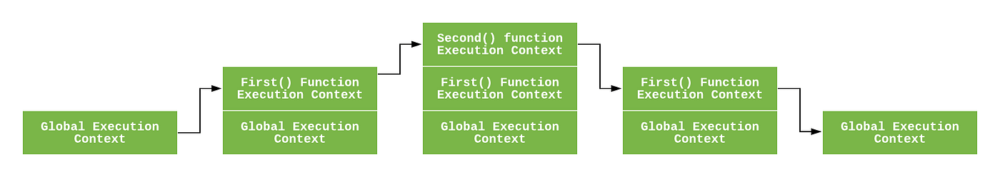

여러분께서 알고 계시는 콜 스택 구조는 사실 정확히 말하자면, **각각의 실행 컨텍스트가 쌓이는 공간**입니다.

<br />
<br />

<Alert
  showIcon
  message="실행 컨텍스트는 코드(함수)가 실행될때마다 매번 생성됩니다."
  description="동일한 코드(함수)라도 2번 실행된다면, 실행 컨텍스트 객체는 2개가 생성됩니다."
  type="info"
/>

<br />
<br />

아래와 같은 예시 코드를 살펴봅시다.

##### 예시 1.

```js showLineNumbers copy
function add (a, b) {
  return a + b;
}

const result1 = add(1, 2);
const result2 = add(result1, 3);
const result3 = add(result2, 4);
const result4 = add(result3, 5);
const result5 = add(result4, 6);
```

우리 자바스크립트 프로그램이 구동되면, 글로벌 실행 컨텍스트가 기본적으로 생성됩니다. 글로벌 실행 컨텍스트를 제외한다면, 위의 예시 코드에서는 몇 개의 실행 컨텍스트가 생성되었을까요?

`add` 함수가 5번 실행되었으므로, 5개의 실행 컨텍스트가 생성되었습니다. 물론 각 함수의 실행이 종료되는 시점에 폐기되기도 했습니다.

<br />
<br />

조금 다른 예시 코드를 한번 더 살펴봅시다.

##### 예시 2.

```js showLineNumbers copy
function addTwo (a) {
  return a + 2;
}

let result = 0;

while (result < 6) {
  result = addTwo(result);
}
```

위의 예시 코드도 마찬가지로 우선 프로그램 초기 구동시 글로벌 실행 컨텍스트가 생성됩니다. 그 외에는 몇 개의 실행 컨텍스트가 생성되었을까요?

`result`가 6일때 `while`문의 조건을 탈출하게 되므로, `addTwo` 함수가 총 3번 실행되었겠죠? 그러므로 총 3개의 실행 컨텍스트가 각각 생성되어 콜 스택에 쌓였다가 종료되며 제거되었을 것입니다.

| 순서        | 실행 구문 | 실행 컨텍스트  |
| :--------  | :---------: |:---------: |
| 첫 번째     |  `addTwo(0);`  |  `a` 매개변수의 값은 **0이라는 정보**가 실행 컨텍스트에 담겨 있습니다. |
| 두 번째     |  `addTwo(2);` |  `a` 매개변수의 값은 **2이라는 정보**가 실행 컨텍스트에 담겨 있습니다. |
| 세 번째     |  `addTwo(4);` |  `a` 매개변수의 값은 **4이라는 정보**가 실행 컨텍스트에 담겨 있습니다. |

<br />

<Alert
  showIcon
  message="실제로 실행되는 코드(함수)의 흐름에 따라 정확한 호출 횟수와 매개변수에 할당되는 값 등을 파악해야 합니다."
  description="정말 바보같은 이야기일 수 있지만, 시각적으로 호출문이 하나라고 해서 실행 컨텍스트가 1개가 생성되는 것은 당연히 아닙니다. 코드의 실제 실행 흐름을 추적해봐야 합니다. 특히나 재귀함수의 흐름을 파악할때 이 부분이 매우 중요합니다."
  type="info"
/>

<br />
<br />

##### 예시 3.

이제 간단한 재귀함수의 실행 흐름을 한번 살펴볼까요?

<br />

<Alert
  showIcon
  message="콜 스택의 아이템에 마우스를 올리면, 실행 당시 코드 정보를 확인할 수 있습니다."
  type="info"
/>

<br />

<Stepper height={"500px"} steps={[
  {
    content: (
      <Row style={{ height: '100%' }}>
        <Col span={12}>
          <Example41 />
          <p style={{ height: '100%', color: '#000000', padding: '0 20px', textAlign: 'left' }}>
            우리 프로그램이 시작하여 글로벌 실행 컨텍스트가 생성됩니다.
          </p>
        </Col>
        <Col style={{ flexDirection: 'column-reverse', display: 'flex' }} span={12}>
          <Row
            style={{
              height: '50px'
            }}
            align="bottom"
          >
            <Col style={{
              height: '90%',
              width: '100%',
              marginTop: '10px',
              padding: '8px 0',
              color: '#ffffff',
              textAlign: 'center',
              fontWeight: 'bold',
            }} span={24}>
              <Popover content={<Example41 />} title="글로벌 실행 컨텍스트" trigger="hover">
                <Button style={{
                  display: 'flex',
                  alignItems: 'center',
                  justifyContent: 'center',
                  width: '100%'
                }}>
                  글로벌 실행 컨텍스트 <SyncOutlined style={{ marginLeft: '5px' }} spin />
                </Button>
              </Popover>
            </Col>
          </Row>
        </Col>
      </Row>
    )
  },

  {
    content: (
      <Row style={{ height: '100%' }}>
        <Col span={12}>
          <Example42 />
          <p style={{ height: '100%', color: '#000000', padding: '0 20px', textAlign: 'left' }}>
            `countDown(3)` 함수 호출문이 실행됩니다.
          </p>
        </Col>
        <Col style={{ flexDirection: 'column-reverse', display: 'flex' }} span={12}>
          <Row
            style={{
              height: '50px'
            }}
            align="bottom"
          >
            <Col style={{
              height: '90%',
              width: '100%',
              marginTop: '10px',
              padding: '8px 0',
              color: '#ffffff',
              textAlign: 'center',
              fontWeight: 'bold',
            }} span={24}>
              <Popover content={<Example41 />} title="글로벌 실행 컨텍스트" trigger="hover">
                <Button style={{
                  display: 'flex',
                  alignItems: 'center',
                  justifyContent: 'center',
                  width: '100%'
                }}>
                  글로벌 실행 컨텍스트 <SyncOutlined style={{ marginLeft: '5px' }} spin />
                </Button>
              </Popover>
            </Col>
          </Row>
        </Col>
      </Row>
    )
  },

  {
    content: (
      <Row style={{ height: '100%' }}>
        <Col span={12}>
          <Example43 />
          <p style={{ height: '100%', color: '#000000', padding: '0 20px', textAlign: 'left' }}>
            `countDown(3)` 함수 호출문이 실행되었기에, 콜 스택에는 해당 실행 컨텍스트가 쌓이게 되고 2번째 줄의 조건문을 판별하게 됩니다.<br/><br/>n은 0이 아니므로, 조건문을 만족하지 않습니다.
          </p>
        </Col>
        <Col style={{ flexDirection: 'column-reverse', display: 'flex' }} span={12}>
          <Row
            style={{
              height: '50px'
            }}
            align="bottom"
          >
            <Col style={{
              height: '90%',
              width: '100%',
              marginTop: '10px',
              padding: '8px 0',
              color: '#ffffff',
              textAlign: 'center',
              fontWeight: 'bold',
            }} span={24}>
              <Popover content={<Example41 />} title="글로벌 실행 컨텍스트" trigger="hover">
                <Button style={{
                  display: 'flex',
                  alignItems: 'center',
                  justifyContent: 'center',
                  width: '100%'
                }}>
                  글로벌 실행 컨텍스트 <SyncOutlined style={{ marginLeft: '5px' }} spin />
                </Button>
              </Popover>
            </Col>
          </Row>
          <Row
            style={{
              height: '50px'
            }}
            align="bottom"
          >
            <Col style={{
              height: '90%',
              width: '100%',
              marginTop: '10px',
              padding: '8px 0',
              color: '#ffffff',
              textAlign: 'center',
              fontWeight: 'bold',
            }} span={24}>
              <Popover content={<Example42 />} title="`countDown` 실행 컨텍스트 (n = 3)" trigger="hover">
                <Button style={{
                  display: 'flex',
                  alignItems: 'center',
                  justifyContent: 'center',
                  width: '100%'
                }}>
                  `countDown` 실행 컨텍스트 (n = 3) <SyncOutlined style={{ marginLeft: '5px' }} spin />
                </Button>
              </Popover>
            </Col>
          </Row>
        </Col>
      </Row>
    )
  },

  {
    content: (
      <Row style={{ height: '100%' }}>
        <Col span={12}>
          <Example44 />
          <p style={{ height: '100%', color: '#000000', padding: '0 20px', textAlign: 'left' }}>
            <b>n = 3인 실행 컨텍스트가 아직 종료되지 않은 상황</b>에서 n = 2가 되어 countDown이 또 다시 새롭게 실행됩니다. 여전히 n = 3 실행 컨텍스트가 실행 중인 상황임을 명심하세요.<br/><br/>
            n = 2 함수 실행문(실행 컨텍스트)이 종료되어야 현재 n = 3인 실행 컨텍스트도 종료될 수 있습니다.
          </p>
        </Col>
        <Col style={{ flexDirection: 'column-reverse', display: 'flex' }} span={12}>
          <Row
            style={{
              height: '50px'
            }}
            align="bottom"
          >
            <Col style={{
              height: '90%',
              width: '100%',
              marginTop: '10px',
              padding: '8px 0',
              color: '#ffffff',
              textAlign: 'center',
              fontWeight: 'bold',
              display: 'flex',
              alignItems: 'center',
              justifyContent: 'center'
            }} span={24}>
              <Popover content={<Example41 />} title="글로벌 실행 컨텍스트" trigger="hover">
                <Button style={{
                  display: 'flex',
                  alignItems: 'center',
                  justifyContent: 'center',
                  width: '100%'
                }}>
                  글로벌 실행 컨텍스트 <SyncOutlined style={{ marginLeft: '5px' }} spin />
                </Button>
              </Popover>
            </Col>
          </Row>
          <Row
            style={{
              height: '50px'
            }}
            align="bottom"
          >
            <Col style={{
              height: '90%',
              width: '100%',
              marginTop: '10px',
              padding: '8px 0',
              color: '#ffffff',
              textAlign: 'center',
              fontWeight: 'bold',
            }} span={24}>
              <Popover content={<Example42 />} title="`countDown` 실행 컨텍스트 (n = 3)" trigger="hover">
                <Button style={{
                  display: 'flex',
                  alignItems: 'center',
                  justifyContent: 'center',
                  width: '100%'
                }}>
                  `countDown` 실행 컨텍스트 (n = 3) <SyncOutlined style={{ marginLeft: '5px' }} spin />
                </Button>
              </Popover>
            </Col>
          </Row>
        </Col>
      </Row>
    )
  },

  {
    content: (
      <Row style={{ height: '100%' }}>
        <Col span={12}>
          <Example45 />
          <p style={{ height: '100%', color: '#000000', padding: '0 20px', textAlign: 'left' }}>
            `countDown(2)` 함수 호출문이 실행되었기에, 콜 스택에는 해당 실행 컨텍스트가 쌓이게 되고 2번째 줄의 조건문을 판별하게 됩니다.<br/><br/>n은 0이 아니므로, 조건문을 만족하지 않습니다.
          </p>
        </Col>
        <Col style={{ flexDirection: 'column-reverse', display: 'flex' }} span={12}>
          <Row
            style={{
              height: '50px'
            }}
            align="bottom"
          >
            <Col style={{
              height: '90%',
              width: '100%',
              marginTop: '10px',
              padding: '8px 0',
              color: '#ffffff',
              textAlign: 'center',
              fontWeight: 'bold',
              display: 'flex',
              alignItems: 'center',
              justifyContent: 'center'
            }} span={24}>
              <Popover content={<Example41 />} title="글로벌 실행 컨텍스트" trigger="hover">
                <Button style={{
                  display: 'flex',
                  alignItems: 'center',
                  justifyContent: 'center',
                  width: '100%'
                }}>
                  글로벌 실행 컨텍스트 <SyncOutlined style={{ marginLeft: '5px' }} spin />
                </Button>
              </Popover>
            </Col>
          </Row>
          <Row
            style={{
              height: '50px'
            }}
            align="bottom"
          >
            <Col style={{
              height: '90%',
              width: '100%',
              marginTop: '10px',
              padding: '8px 0',
              color: '#ffffff',
              textAlign: 'center',
              fontWeight: 'bold',
            }} span={24}>
              <Popover content={<Example42 />} title="`countDown` 실행 컨텍스트 (n = 3)" trigger="hover">
                <Button style={{
                  display: 'flex',
                  alignItems: 'center',
                  justifyContent: 'center',
                  width: '100%'
                }}>
                  `countDown` 실행 컨텍스트 (n = 3) <SyncOutlined style={{ marginLeft: '5px' }} spin />
                </Button>
              </Popover>
            </Col>
          </Row>
          <Row
            style={{
              height: '50px'
            }}
            align="bottom"
          >
            <Col style={{
              height: '90%',
              width: '100%',
              marginTop: '10px',
              padding: '8px 0',
              color: '#ffffff',
              textAlign: 'center',
              fontWeight: 'bold',
            }} span={24}>
              <Popover content={<Example44 />} title="`countDown` 실행 컨텍스트 (n = 2)" trigger="hover">
                <Button style={{
                  display: 'flex',
                  alignItems: 'center',
                  justifyContent: 'center',
                  width: '100%'
                }}>
                  `countDown` 실행 컨텍스트 (n = 2) <SyncOutlined style={{ marginLeft: '5px' }} spin />
                </Button>
              </Popover>
            </Col>
          </Row>
        </Col>
      </Row>
    )
  },

  {
    content: (
      <Row style={{ height: '100%' }}>
        <Col span={12}>
          <Example46 />
          <p style={{ height: '100%', color: '#000000', padding: '0 20px', textAlign: 'left' }}>
            <b>n = 2인 실행 컨텍스트가 아직 종료되지 않은 상황</b>에서 n = 1이 되어 countDown이 또 다시 새롭게 실행됩니다. 여전히 n = 2 실행 컨텍스트가 실행 중인 상황임을 명심하세요.<br/><br/>
            n = 1 함수 실행문(실행 컨텍스트)이 종료되어야 현재 n = 2인 실행 컨텍스트도 종료될 수 있습니다.
          </p>
        </Col>
        <Col style={{ flexDirection: 'column-reverse', display: 'flex' }} span={12}>
          <Row
            style={{
              height: '50px'
            }}
            align="bottom"
          >
            <Col style={{
              height: '90%',
              width: '100%',
              marginTop: '10px',
              padding: '8px 0',
              color: '#ffffff',
              textAlign: 'center',
              fontWeight: 'bold',
              display: 'flex',
              alignItems: 'center',
              justifyContent: 'center'
            }} span={24}>
              <Popover content={<Example41 />} title="글로벌 실행 컨텍스트" trigger="hover">
                <Button style={{
                  display: 'flex',
                  alignItems: 'center',
                  justifyContent: 'center',
                  width: '100%'
                }}>
                  글로벌 실행 컨텍스트 <SyncOutlined style={{ marginLeft: '5px' }} spin />
                </Button>
              </Popover>
            </Col>
          </Row>
          <Row
            style={{
              height: '50px'
            }}
            align="bottom"
          >
            <Col style={{
              height: '90%',
              width: '100%',
              marginTop: '10px',
              padding: '8px 0',
              color: '#ffffff',
              textAlign: 'center',
              fontWeight: 'bold',
            }} span={24}>
              <Popover content={<Example42 />} title="`countDown` 실행 컨텍스트 (n = 3)" trigger="hover">
                <Button style={{
                  display: 'flex',
                  alignItems: 'center',
                  justifyContent: 'center',
                  width: '100%'
                }}>
                  `countDown` 실행 컨텍스트 (n = 3) <SyncOutlined style={{ marginLeft: '5px' }} spin />
                </Button>
              </Popover>
            </Col>
          </Row>
          <Row
            style={{
              height: '50px'
            }}
            align="bottom"
          >
            <Col style={{
              height: '90%',
              width: '100%',
              marginTop: '10px',
              padding: '8px 0',
              color: '#ffffff',
              textAlign: 'center',
              fontWeight: 'bold',
            }} span={24}>
              <Popover content={<Example44 />} title="`countDown` 실행 컨텍스트 (n = 2)" trigger="hover">
                <Button style={{
                  display: 'flex',
                  alignItems: 'center',
                  justifyContent: 'center',
                  width: '100%'
                }}>
                  `countDown` 실행 컨텍스트 (n = 2) <SyncOutlined style={{ marginLeft: '5px' }} spin />
                </Button>
              </Popover>
            </Col>
          </Row>
        </Col>
      </Row>
    )
  },

  {
    content: (
      <Row style={{ height: '100%' }}>
        <Col span={12}>
          <Example47 />
          <p style={{ height: '100%', color: '#000000', padding: '0 20px', textAlign: 'left' }}>
            `countDown(1)` 함수 호출문이 실행되었기에, 콜 스택에는 해당 실행 컨텍스트가 쌓이게 되고 2번째 줄의 조건문을 판별하게 됩니다.<br/><br/>n은 0이 아니므로, 조건문을 만족하지 않습니다.
          </p>
        </Col>
        <Col style={{ flexDirection: 'column-reverse', display: 'flex' }} span={12}>
          <Row
            style={{
              height: '50px'
            }}
            align="bottom"
          >
            <Col style={{
              height: '90%',
              width: '100%',
              marginTop: '10px',
              padding: '8px 0',
              color: '#ffffff',
              textAlign: 'center',
              fontWeight: 'bold',
              display: 'flex',
              alignItems: 'center',
              justifyContent: 'center'
            }} span={24}>
              <Popover content={<Example41 />} title="글로벌 실행 컨텍스트" trigger="hover">
                <Button style={{
                  display: 'flex',
                  alignItems: 'center',
                  justifyContent: 'center',
                  width: '100%'
                }}>
                  글로벌 실행 컨텍스트 <SyncOutlined style={{ marginLeft: '5px' }} spin />
                </Button>
              </Popover>
            </Col>
          </Row>
          <Row
            style={{
              height: '50px'
            }}
            align="bottom"
          >
            <Col style={{
              height: '90%',
              width: '100%',
              marginTop: '10px',
              padding: '8px 0',
              color: '#ffffff',
              textAlign: 'center',
              fontWeight: 'bold',
            }} span={24}>
              <Popover content={<Example42 />} title="`countDown` 실행 컨텍스트 (n = 3)" trigger="hover">
                <Button style={{
                  display: 'flex',
                  alignItems: 'center',
                  justifyContent: 'center',
                  width: '100%'
                }}>
                  `countDown` 실행 컨텍스트 (n = 3) <SyncOutlined style={{ marginLeft: '5px' }} spin />
                </Button>
              </Popover>
            </Col>
          </Row>
          <Row
            style={{
              height: '50px'
            }}
            align="bottom"
          >
            <Col style={{
              height: '90%',
              width: '100%',
              marginTop: '10px',
              padding: '8px 0',
              color: '#ffffff',
              textAlign: 'center',
              fontWeight: 'bold',
            }} span={24}>
              <Popover content={<Example44 />} title="`countDown` 실행 컨텍스트 (n = 2)" trigger="hover">
                <Button style={{
                  display: 'flex',
                  alignItems: 'center',
                  justifyContent: 'center',
                  width: '100%'
                }}>
                  `countDown` 실행 컨텍스트 (n = 2) <SyncOutlined style={{ marginLeft: '5px' }} spin />
                </Button>
              </Popover>
            </Col>
          </Row>
          <Row
            style={{
              height: '50px'
            }}
            align="bottom"
          >
            <Col style={{
              height: '90%',
              width: '100%',
              marginTop: '10px',
              padding: '8px 0',
              color: '#ffffff',
              textAlign: 'center',
              fontWeight: 'bold',
            }} span={24}>
              <Popover content={<Example46 />} title="`countDown` 실행 컨텍스트 (n = 1)" trigger="hover">
                <Button style={{
                  display: 'flex',
                  alignItems: 'center',
                  justifyContent: 'center',
                  width: '100%'
                }}>
                  `countDown` 실행 컨텍스트 (n = 1) <SyncOutlined style={{ marginLeft: '5px' }} spin />
                </Button>
              </Popover>
            </Col>
          </Row>
        </Col>
      </Row>
    )
  },

  {
    content: (
      <Row style={{ height: '100%' }}>
        <Col span={12}>
          <Example48 />
          <p style={{ height: '100%', color: '#000000', padding: '0 20px', textAlign: 'left' }}>
            <b>n = 1인 실행 컨텍스트가 아직 종료되지 않은 상황</b>에서 n = 0이 되어 countDown이 또 다시 새롭게 실행됩니다. 여전히 n = 1 실행 컨텍스트가 실행 중인 상황임을 명심하세요.<br/><br/>
            n = 0 함수 실행문(실행 컨텍스트)이 종료되어야 현재 n = 1인 실행 컨텍스트도 종료될 수 있습니다.
          </p>
        </Col>
        <Col style={{ flexDirection: 'column-reverse', display: 'flex' }} span={12}>
          <Row
            style={{
              height: '50px'
            }}
            align="bottom"
          >
            <Col style={{
              height: '90%',
              width: '100%',
              marginTop: '10px',
              padding: '8px 0',
              color: '#ffffff',
              textAlign: 'center',
              fontWeight: 'bold',
              display: 'flex',
              alignItems: 'center',
              justifyContent: 'center'
            }} span={24}>
              <Popover content={<Example41 />} title="글로벌 실행 컨텍스트" trigger="hover">
                <Button style={{
                  display: 'flex',
                  alignItems: 'center',
                  justifyContent: 'center',
                  width: '100%'
                }}>
                  글로벌 실행 컨텍스트 <SyncOutlined style={{ marginLeft: '5px' }} spin />
                </Button>
              </Popover>
            </Col>
          </Row>
          <Row
            style={{
              height: '50px'
            }}
            align="bottom"
          >
            <Col style={{
              height: '90%',
              width: '100%',
              marginTop: '10px',
              padding: '8px 0',
              color: '#ffffff',
              textAlign: 'center',
              fontWeight: 'bold',
            }} span={24}>
              <Popover content={<Example42 />} title="`countDown` 실행 컨텍스트 (n = 3)" trigger="hover">
                <Button style={{
                  display: 'flex',
                  alignItems: 'center',
                  justifyContent: 'center',
                  width: '100%'
                }}>
                  `countDown` 실행 컨텍스트 (n = 3) <SyncOutlined style={{ marginLeft: '5px' }} spin />
                </Button>
              </Popover>
            </Col>
          </Row>
          <Row
            style={{
              height: '50px'
            }}
            align="bottom"
          >
            <Col style={{
              height: '90%',
              width: '100%',
              marginTop: '10px',
              padding: '8px 0',
              color: '#ffffff',
              textAlign: 'center',
              fontWeight: 'bold',
            }} span={24}>
              <Popover content={<Example44 />} title="`countDown` 실행 컨텍스트 (n = 2)" trigger="hover">
                <Button style={{
                  display: 'flex',
                  alignItems: 'center',
                  justifyContent: 'center',
                  width: '100%'
                }}>
                  `countDown` 실행 컨텍스트 (n = 2) <SyncOutlined style={{ marginLeft: '5px' }} spin />
                </Button>
              </Popover>
            </Col>
          </Row>
          <Row
            style={{
              height: '50px'
            }}
            align="bottom"
          >
            <Col style={{
              height: '90%',
              width: '100%',
              marginTop: '10px',
              padding: '8px 0',
              color: '#ffffff',
              textAlign: 'center',
              fontWeight: 'bold',
            }} span={24}>
              <Popover content={<Example46 />} title="`countDown` 실행 컨텍스트 (n = 1)" trigger="hover">
                <Button style={{
                  display: 'flex',
                  alignItems: 'center',
                  justifyContent: 'center',
                  width: '100%'
                }}>
                  `countDown` 실행 컨텍스트 (n = 1) <SyncOutlined style={{ marginLeft: '5px' }} spin />
                </Button>
              </Popover>
            </Col>
          </Row>
        </Col>
      </Row>
    )
  },

  {
    content: (
      <Row style={{ height: '100%' }}>
        <Col span={12}>
          <Example49 />
          <p style={{ height: '100%', color: '#000000', padding: '0 20px', textAlign: 'left' }}>
            `countDown(0)` 함수 호출문이 실행되었기에, 콜 스택에는 해당 실행 컨텍스트가 쌓이게 되고 2번째 줄의 조건문을 판별하게 됩니다.<br/><br/>n은 0과 일치하므로, <b>조건문 내부로 진입합니다.</b>
          </p>
        </Col>
        <Col style={{ flexDirection: 'column-reverse', display: 'flex' }} span={12}>
          <Row
            style={{
              height: '50px'
            }}
            align="bottom"
          >
            <Col style={{
              height: '90%',
              width: '100%',
              marginTop: '10px',
              padding: '8px 0',
              color: '#ffffff',
              textAlign: 'center',
              fontWeight: 'bold',
              display: 'flex',
              alignItems: 'center',
              justifyContent: 'center'
            }} span={24}>
              <Popover content={<Example41 />} title="글로벌 실행 컨텍스트" trigger="hover">
                <Button style={{
                  display: 'flex',
                  alignItems: 'center',
                  justifyContent: 'center',
                  width: '100%'
                }}>
                  글로벌 실행 컨텍스트 <SyncOutlined style={{ marginLeft: '5px' }} spin />
                </Button>
              </Popover>
            </Col>
          </Row>
          <Row
            style={{
              height: '50px'
            }}
            align="bottom"
          >
            <Col style={{
              height: '90%',
              width: '100%',
              marginTop: '10px',
              padding: '8px 0',
              color: '#ffffff',
              textAlign: 'center',
              fontWeight: 'bold',
            }} span={24}>
              <Popover content={<Example42 />} title="`countDown` 실행 컨텍스트 (n = 3)" trigger="hover">
                <Button style={{
                  display: 'flex',
                  alignItems: 'center',
                  justifyContent: 'center',
                  width: '100%'
                }}>
                  `countDown` 실행 컨텍스트 (n = 3) <SyncOutlined style={{ marginLeft: '5px' }} spin />
                </Button>
              </Popover>
            </Col>
          </Row>
          <Row
            style={{
              height: '50px'
            }}
            align="bottom"
          >
            <Col style={{
              height: '90%',
              width: '100%',
              marginTop: '10px',
              padding: '8px 0',
              color: '#ffffff',
              textAlign: 'center',
              fontWeight: 'bold',
            }} span={24}>
              <Popover content={<Example44 />} title="`countDown` 실행 컨텍스트 (n = 2)" trigger="hover">
                <Button style={{
                  display: 'flex',
                  alignItems: 'center',
                  justifyContent: 'center',
                  width: '100%'
                }}>
                  `countDown` 실행 컨텍스트 (n = 2) <SyncOutlined style={{ marginLeft: '5px' }} spin />
                </Button>
              </Popover>
            </Col>
          </Row>
          <Row
            style={{
              height: '50px'
            }}
            align="bottom"
          >
            <Col style={{
              height: '90%',
              width: '100%',
              marginTop: '10px',
              padding: '8px 0',
              color: '#ffffff',
              textAlign: 'center',
              fontWeight: 'bold',
            }} span={24}>
              <Popover content={<Example46 />} title="`countDown` 실행 컨텍스트 (n = 1)" trigger="hover">
                <Button style={{
                  display: 'flex',
                  alignItems: 'center',
                  justifyContent: 'center',
                  width: '100%'
                }}>
                  `countDown` 실행 컨텍스트 (n = 1) <SyncOutlined style={{ marginLeft: '5px' }} spin />
                </Button>
              </Popover>
            </Col>
          </Row>
          <Row
            style={{
              height: '50px'
            }}
            align="bottom"
          >
            <Col style={{
              height: '90%',
              width: '100%',
              marginTop: '10px',
              padding: '8px 0',
              color: '#ffffff',
              textAlign: 'center',
              fontWeight: 'bold',
            }} span={24}>
              <Popover content={<Example48 />} title="`countDown` 실행 컨텍스트 (n = 0)" trigger="hover">
                <Button style={{
                  display: 'flex',
                  alignItems: 'center',
                  justifyContent: 'center',
                  width: '100%'
                }}>
                  `countDown` 실행 컨텍스트 (n = 0) <SyncOutlined style={{ marginLeft: '5px' }} spin />
                </Button>
              </Popover>
            </Col>
          </Row>
        </Col>
      </Row>
    )
  },

  {
    content: (
      <Row style={{ height: '100%' }}>
        <Col span={12}>
          <Example410 />
          <p style={{ height: '100%', color: '#000000', padding: '0 20px', textAlign: 'left' }}>
            n = 0인 실행 컨텍스트는 `return`문을 만나게 되어 실행이 종료되고 실행 컨텍스트는 콜 스택에서 제거됩니다.<br /><br />
          </p>
        </Col>
        <Col style={{ flexDirection: 'column-reverse', display: 'flex' }} span={12}>
          <Row
            style={{
              height: '50px'
            }}
            align="bottom"
          >
            <Col style={{
              height: '90%',
              width: '100%',
              marginTop: '10px',
              padding: '8px 0',
              color: '#ffffff',
              textAlign: 'center',
              fontWeight: 'bold',
              display: 'flex',
              alignItems: 'center',
              justifyContent: 'center'
            }} span={24}>
              <Popover content={<Example41 />} title="글로벌 실행 컨텍스트" trigger="hover">
                <Button style={{
                  display: 'flex',
                  alignItems: 'center',
                  justifyContent: 'center',
                  width: '100%'
                }}>
                  글로벌 실행 컨텍스트 <SyncOutlined style={{ marginLeft: '5px' }} spin />
                </Button>
              </Popover>
            </Col>
          </Row>
          <Row
            style={{
              height: '50px'
            }}
            align="bottom"
          >
            <Col style={{
              height: '90%',
              width: '100%',
              marginTop: '10px',
              padding: '8px 0',
              color: '#ffffff',
              textAlign: 'center',
              fontWeight: 'bold',
            }} span={24}>
              <Popover content={<Example42 />} title="`countDown` 실행 컨텍스트 (n = 3)" trigger="hover">
                <Button style={{
                  display: 'flex',
                  alignItems: 'center',
                  justifyContent: 'center',
                  width: '100%'
                }}>
                  `countDown` 실행 컨텍스트 (n = 3) <SyncOutlined style={{ marginLeft: '5px' }} spin />
                </Button>
              </Popover>
            </Col>
          </Row>
          <Row
            style={{
              height: '50px'
            }}
            align="bottom"
          >
            <Col style={{
              height: '90%',
              width: '100%',
              marginTop: '10px',
              padding: '8px 0',
              color: '#ffffff',
              textAlign: 'center',
              fontWeight: 'bold',
            }} span={24}>
              <Popover content={<Example44 />} title="`countDown` 실행 컨텍스트 (n = 2)" trigger="hover">
                <Button style={{
                  display: 'flex',
                  alignItems: 'center',
                  justifyContent: 'center',
                  width: '100%'
                }}>
                  `countDown` 실행 컨텍스트 (n = 2) <SyncOutlined style={{ marginLeft: '5px' }} spin />
                </Button>
              </Popover>
            </Col>
          </Row>
          <Row
            style={{
              height: '50px'
            }}
            align="bottom"
          >
            <Col style={{
              height: '90%',
              width: '100%',
              marginTop: '10px',
              padding: '8px 0',
              color: '#ffffff',
              textAlign: 'center',
              fontWeight: 'bold',
            }} span={24}>
              <Popover content={<Example46 />} title="`countDown` 실행 컨텍스트 (n = 1)" trigger="hover">
                <Button style={{
                  display: 'flex',
                  alignItems: 'center',
                  justifyContent: 'center',
                  width: '100%'
                }}>
                  `countDown` 실행 컨텍스트 (n = 1) <SyncOutlined style={{ marginLeft: '5px' }} spin />
                </Button>
              </Popover>
            </Col>
          </Row>
          <Row
            style={{
              height: '50px'
            }}
            align="bottom"
          >
            <Col style={{
              height: '90%',
              width: '100%',
              marginTop: '10px',
              padding: '8px 0',
              color: '#ffffff',
              textAlign: 'center',
              fontWeight: 'bold',
            }} span={24}>
              <Popover content={<Example48 />} title="`countDown` 실행 컨텍스트 (n = 0)" trigger="hover">
                <Button style={{
                  display: 'flex',
                  alignItems: 'center',
                  justifyContent: 'center',
                  width: '100%'
                }}>
                  `countDown` 실행 컨텍스트 (n = 0) <SyncOutlined style={{ marginLeft: '5px' }} spin />
                </Button>
              </Popover>
            </Col>
          </Row>
        </Col>
      </Row>
    )
  },

  {
    content: (
      <Row style={{ height: '100%' }}>
        <Col span={12}>
          <Example411 />
          <p style={{ height: '100%', color: '#000000', padding: '0 20px', textAlign: 'left' }}>
            n = 0인 실행 컨텍스트가 종료되었으므로, 우리는 n = 0인 실행 컨텍스트가 시작되었던 시점으로 돌아옵니다.<br /><br />
            
            n = 0인 실행 컨텍스트가 시작되었던 시점은 n = 1인 함수 호출문의 6번째 줄이었습니다. 이 곳에서 추가적으로 실행할 로직이 없으므로 n = 1 실행 컨텍스트 또한 실행이 종료되고 콜 스택에서 제거됩니다.
          </p>
        </Col>
        <Col style={{ flexDirection: 'column-reverse', display: 'flex' }} span={12}>
          <Row
            style={{
              height: '50px'
            }}
            align="bottom"
          >
            <Col style={{
              height: '90%',
              width: '100%',
              marginTop: '10px',
              padding: '8px 0',
              color: '#ffffff',
              textAlign: 'center',
              fontWeight: 'bold',
              display: 'flex',
              alignItems: 'center',
              justifyContent: 'center'
            }} span={24}>
              <Popover content={<Example41 />} title="글로벌 실행 컨텍스트" trigger="hover">
                <Button style={{
                  display: 'flex',
                  alignItems: 'center',
                  justifyContent: 'center',
                  width: '100%'
                }}>
                  글로벌 실행 컨텍스트 <SyncOutlined style={{ marginLeft: '5px' }} spin />
                </Button>
              </Popover>
            </Col>
          </Row>
          <Row
            style={{
              height: '50px'
            }}
            align="bottom"
          >
            <Col style={{
              height: '90%',
              width: '100%',
              marginTop: '10px',
              padding: '8px 0',
              color: '#ffffff',
              textAlign: 'center',
              fontWeight: 'bold',
            }} span={24}>
              <Popover content={<Example42 />} title="`countDown` 실행 컨텍스트 (n = 3)" trigger="hover">
                <Button style={{
                  display: 'flex',
                  alignItems: 'center',
                  justifyContent: 'center',
                  width: '100%'
                }}>
                  `countDown` 실행 컨텍스트 (n = 3) <SyncOutlined style={{ marginLeft: '5px' }} spin />
                </Button>
              </Popover>
            </Col>
          </Row>
          <Row
            style={{
              height: '50px'
            }}
            align="bottom"
          >
            <Col style={{
              height: '90%',
              width: '100%',
              marginTop: '10px',
              padding: '8px 0',
              color: '#ffffff',
              textAlign: 'center',
              fontWeight: 'bold',
            }} span={24}>
              <Popover content={<Example44 />} title="`countDown` 실행 컨텍스트 (n = 2)" trigger="hover">
                <Button style={{
                  display: 'flex',
                  alignItems: 'center',
                  justifyContent: 'center',
                  width: '100%'
                }}>
                  `countDown` 실행 컨텍스트 (n = 2) <SyncOutlined style={{ marginLeft: '5px' }} spin />
                </Button>
              </Popover>
            </Col>
          </Row>
          <Row
            style={{
              height: '50px'
            }}
            align="bottom"
          >
            <Col style={{
              height: '90%',
              width: '100%',
              marginTop: '10px',
              padding: '8px 0',
              color: '#ffffff',
              textAlign: 'center',
              fontWeight: 'bold',
            }} span={24}>
              <Popover content={<Example46 />} title="`countDown` 실행 컨텍스트 (n = 1)" trigger="hover">
                <Button style={{
                  display: 'flex',
                  alignItems: 'center',
                  justifyContent: 'center',
                  width: '100%'
                }}>
                  `countDown` 실행 컨텍스트 (n = 1) <SyncOutlined style={{ marginLeft: '5px' }} spin />
                </Button>
              </Popover>
            </Col>
          </Row>
        </Col>
      </Row>
    )
  },

  {
    content: (
      <Row style={{ height: '100%' }}>
        <Col span={12}>
          <Example412 />
          <p style={{ height: '100%', color: '#000000', padding: '0 20px', textAlign: 'left' }}>
            n = 1인 실행 컨텍스트가 종료되었으므로, 우리는 n = 1인 실행 컨텍스트가 시작되었던 시점으로 돌아옵니다.<br /><br />

            n = 1인 실행 컨텍스트가 시작되었던 시점은 n = 2인 함수 호출문의 6번째 줄이었습니다. 이 곳에서 추가적으로 실행할 로직이 없으므로 n = 2 실행 컨텍스트 또한 실행이 종료되고 콜 스택에서 제거됩니다.
          </p>
        </Col>
        <Col style={{ flexDirection: 'column-reverse', display: 'flex' }} span={12}>
          <Row
            style={{
              height: '50px'
            }}
            align="bottom"
          >
            <Col style={{
              height: '90%',
              width: '100%',
              marginTop: '10px',
              padding: '8px 0',
              color: '#ffffff',
              textAlign: 'center',
              fontWeight: 'bold',
              display: 'flex',
              alignItems: 'center',
              justifyContent: 'center'
            }} span={24}>
              <Popover content={<Example41 />} title="글로벌 실행 컨텍스트" trigger="hover">
                <Button style={{
                  display: 'flex',
                  alignItems: 'center',
                  justifyContent: 'center',
                  width: '100%'
                }}>
                  글로벌 실행 컨텍스트 <SyncOutlined style={{ marginLeft: '5px' }} spin />
                </Button>
              </Popover>
            </Col>
          </Row>
          <Row
            style={{
              height: '50px'
            }}
            align="bottom"
          >
            <Col style={{
              height: '90%',
              width: '100%',
              marginTop: '10px',
              padding: '8px 0',
              color: '#ffffff',
              textAlign: 'center',
              fontWeight: 'bold',
            }} span={24}>
              <Popover content={<Example42 />} title="`countDown` 실행 컨텍스트 (n = 3)" trigger="hover">
                <Button style={{
                  display: 'flex',
                  alignItems: 'center',
                  justifyContent: 'center',
                  width: '100%'
                }}>
                  `countDown` 실행 컨텍스트 (n = 3) <SyncOutlined style={{ marginLeft: '5px' }} spin />
                </Button>
              </Popover>
            </Col>
          </Row>
          <Row
            style={{
              height: '50px'
            }}
            align="bottom"
          >
            <Col style={{
              height: '90%',
              width: '100%',
              marginTop: '10px',
              padding: '8px 0',
              color: '#ffffff',
              textAlign: 'center',
              fontWeight: 'bold',
            }} span={24}>
              <Popover content={<Example44 />} title="`countDown` 실행 컨텍스트 (n = 2)" trigger="hover">
                <Button style={{
                  display: 'flex',
                  alignItems: 'center',
                  justifyContent: 'center',
                  width: '100%'
                }}>
                  `countDown` 실행 컨텍스트 (n = 2) <SyncOutlined style={{ marginLeft: '5px' }} spin />
                </Button>
              </Popover>
            </Col>
          </Row>
        </Col>
      </Row>
    )
  },

  {
    content: (
      <Row style={{ height: '100%' }}>
        <Col span={12}>
          <Example413 />
          <p style={{ height: '100%', color: '#000000', padding: '0 20px', textAlign: 'left' }}>
            n = 2인 실행 컨텍스트가 종료되었으므로, 우리는 n = 2인 실행 컨텍스트가 시작되었던 시점으로 돌아옵니다.<br /><br />

            n = 2인 실행 컨텍스트가 시작되었던 시점은 n = 3인 함수 호출문의 6번째 줄이었습니다. 이 곳에서 추가적으로 실행할 로직이 없으므로 n = 3 실행 컨텍스트 또한 실행이 종료되고 콜 스택에서 제거됩니다.
          </p>
        </Col>
        <Col style={{ flexDirection: 'column-reverse', display: 'flex' }} span={12}>
          <Row
            style={{
              height: '50px'
            }}
            align="bottom"
          >
            <Col style={{
              height: '90%',
              width: '100%',
              marginTop: '10px',
              padding: '8px 0',
              color: '#ffffff',
              textAlign: 'center',
              fontWeight: 'bold',
              display: 'flex',
              alignItems: 'center',
              justifyContent: 'center'
            }} span={24}>
              <Popover content={<Example41 />} title="글로벌 실행 컨텍스트" trigger="hover">
                <Button style={{
                  display: 'flex',
                  alignItems: 'center',
                  justifyContent: 'center',
                  width: '100%'
                }}>
                  글로벌 실행 컨텍스트 <SyncOutlined style={{ marginLeft: '5px' }} spin />
                </Button>
              </Popover>
            </Col>
          </Row>
          <Row
            style={{
              height: '50px'
            }}
            align="bottom"
          >
            <Col style={{
              height: '90%',
              width: '100%',
              marginTop: '10px',
              padding: '8px 0',
              color: '#ffffff',
              textAlign: 'center',
              fontWeight: 'bold',
            }} span={24}>
              <Popover content={<Example42 />} title="`countDown` 실행 컨텍스트 (n = 3)" trigger="hover">
                <Button style={{
                  display: 'flex',
                  alignItems: 'center',
                  justifyContent: 'center',
                  width: '100%'
                }}>
                  `countDown` 실행 컨텍스트 (n = 3) <SyncOutlined style={{ marginLeft: '5px' }} spin />
                </Button>
              </Popover>
            </Col>
          </Row>
        </Col>
      </Row>
    )
  },

  {
    content: (
      <Row style={{ height: '100%' }}>
        <Col span={12}>
          <Example414 />
          <p style={{ height: '100%', color: '#000000', padding: '0 20px', textAlign: 'left' }}>
            countDown(3) 함수 실행 구문이 모두 종료됩니다.
          </p>
        </Col>
        <Col style={{ flexDirection: 'column-reverse', display: 'flex' }} span={12}>
          <Row
            style={{
              height: '50px'
            }}
            align="bottom"
          >
            <Col style={{
              height: '90%',
              width: '100%',
              marginTop: '10px',
              padding: '8px 0',
              color: '#ffffff',
              textAlign: 'center',
              fontWeight: 'bold',
              display: 'flex',
              alignItems: 'center',
              justifyContent: 'center'
            }} span={24}>
              <Popover content={<Example41 />} title="글로벌 실행 컨텍스트" trigger="hover">
                <Button style={{
                  display: 'flex',
                  alignItems: 'center',
                  justifyContent: 'center',
                  width: '100%'
                }}>
                  글로벌 실행 컨텍스트 <SyncOutlined style={{ marginLeft: '5px' }} spin />
                </Button>
              </Popover>
            </Col>
          </Row>
        </Col>
      </Row>
    )
  },

  {
    content: (
      <Row style={{ height: '100%' }}>
        <Col span={12}>
          <Example415 />
          <p style={{ height: '100%', color: '#000000', padding: '0 20px', textAlign: 'left' }}>
            우리 프로그램이 모두 종료됩니다.
          </p>
        </Col>
        <Col style={{ flexDirection: 'column-reverse', display: 'flex' }} span={12}>
        </Col>
      </Row>
    )
  }
]}/>

<br/>
<br/>

## 작성 팁

<Rate disabled={true} value={5} />
<br/>
<br/>

### 종료 조건을 작성하고 확인할 것

위의 예시 코드에서 눈치 채셨을 수 있지만, 재귀함수에서 가장 중요한 것은 로직의 탈출구, 즉 **종료 조건**을 마련하는 것입니다.

이제는 다들 아시겠지만, 재귀함수는 자기 자신을 다시금 호출하는 함수를 일컫습니다. 자기 자신을 계속 다시 호출한다면, 끝없이 반복하겠죠? 이 끝없는 반복을 끝내기 위해서는 탈출해야 하는 종료 조건이 있어야만 합니다.

예를 들어, 위의 예시 3번, `countDown` 함수에서는 `n === 0{:js}`과 같은 로직이 그 종료 조건이 될 수 있습니다.

많은 이들이 종료 조건이 필요하다는 것을 알고 있지만, 이와 관련하여 자주 실수하는 부분이 있습니다.

<br />
<Alert
  showIcon
  message="종료 조건이 실행되는지 꼭 확인할 것"
  description="많은 이들이 종료 조건의 실제 실행 여부를 제대로 확인하지 않고 재귀함수가 의도되지 않을때 디버깅으로 많은 시간을 허비하는 경우가 많습니다. 특별한 주의를 기울이세요."
  type="warning"
/>

<br/>
<br/>

##### 예시 4.

아래와 같은 예시 코드는 종료 조건이 존재하는 것처럼 보입니다. 실제로 실행시킬 경우 어떻게 될까요?

```js showLineNumbers
function stopIfEven (n) {
  if (n % 2 === 0) {
    return;
  }

  stopIfEven(n - 2);
}

stopIfEven(101); 
```

물론 위의 예시 코드는 과장된 예시로서 너무나도 명백히 종료 조건이 실행되지 않는다는 것이 눈에 보이지만, 실제 작업을 하는 상황에서도 이와 비슷한 경우가 매우 빈번히 발생합니다.

실제로 종료 조건을 작성했는지가 중요한 것이 아닙니다. **종료 조건이 실제로 실행되는지가 중요한 것입니다.**

<br/>
<br/>

### `debugger`를 활용할 것

종료 조건이 실제로 실행되는지에 대한 여부는 어떻게 확인하는 것이 좋을까요?

이 순간 만큼은 `debugger`를 반드시 시도하셔야 합니다.

> `debugger`는 우리 코드의 실행 흐름을 아주 샅샅이 쫓아가며 살펴볼 수 있도록 돕는 기능입니다.
> 
> 시간이 걸리더라도, 현재 살펴보는 코드에 대해 100% 이해하고 의심의 소지가 없도록 하고 넘어가는 것이 좋습니다. 그렇지 않으면, 결국 돌아와 중복된 시간 투자가 필요해질 수 있습니다.
>
> 급하게 서두르지 마세요. **한번 할때 확실하게 하세요.**

아직 `debugger`를 사용해본 적이 없으시다구요? 괜찮습니다. 지금 제가 간단히 알려드리겠습니다.

<br />
<br />

#### Step 1

브라우저 개발자 도구를 열고 콘솔창에 아래의 코드를 입력해보세요.

<br />
<Alert
  showIcon
  message="debugger 삽입 위치"
  description="여러분께서 살펴보고 싶은 로직의 앞쪽에 debugger를 위치시켜 주세요."
  type="info"
/>

```js showLineNumbers copy
function countDown (n) {
  if (n === 0) {
    return;
  }
 
  countDown(n - 1);
}

debugger;
countDown(3);
```

<br />
<br />

#### Step 2

아래와 같은 상태로 진입하셨나요?

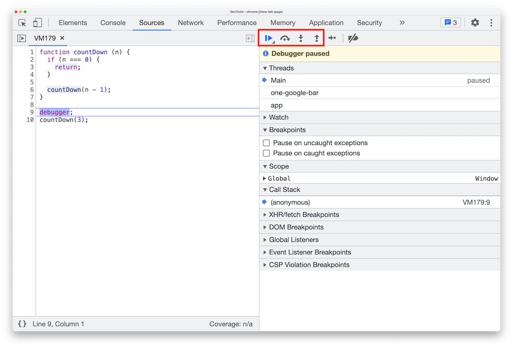

제가 빨간 박스로 표시한 4개의 버튼을 이용하여 우리는 디버깅 과정을 제어할 것입니다.

| 버튼 이름  | 아이콘 | 기능  |
| :--------| :---------: |:---------: |
| Play     |  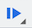  |  멈춤과 재생을 할 수 있는 버튼입니다. |
| Step over|  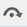 |  다음 실행구문으로 이동하는 버튼입니다.<br/>비유적으로 설명하자면, 다음 줄로 이동한다고 이해하셔도 괜찮습니다. |
| Step in  |  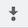 |  함수 실행문을 만났을때, 해당 함수 내부로 진입할 수 있는 버튼입니다. |
| Step out |  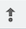  |  함수 내부로 진입한 상태에서 다시 빠져나갈 수 있는 버튼입니다. |

<br />
<br />

#### Step 3

개발자 도구에서 <span style={{ color: "green", fontWeight: "bold" }}>Step OVER 버튼을 1회 클릭</span>해보세요. 아래와 같은 상태로 변경될 것입니다.

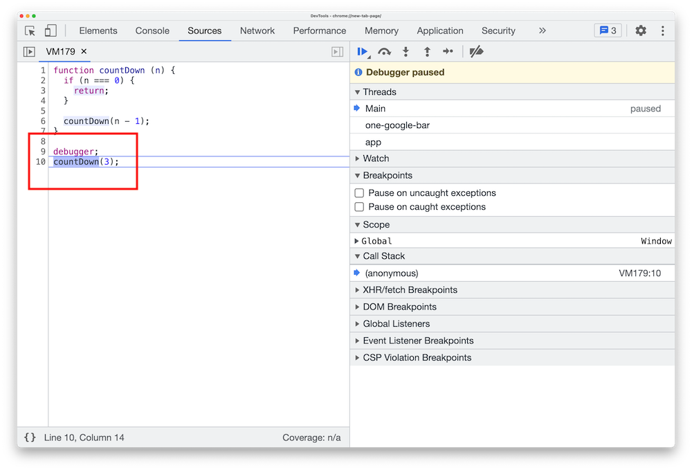

함수 실행문을 만난 상태가 되었습니다. 현재 상태는 `countDown(3);`이라는 함수 실행문이 실행되기 직전인 상태입니다.

함수 실행문의 내부로 진입하여 조금 더 자세한 내용을 살펴보고 싶다면, Step in을 이용해 살펴볼 수 있습니다.

<br />
<br />

#### Step 4

개발자 도구에서 <span style={{ color: "green", fontWeight: "bold" }}>Step IN 버튼을 1회 클릭</span>해보세요. 아래와 같은 상태로 변경될 것입니다.

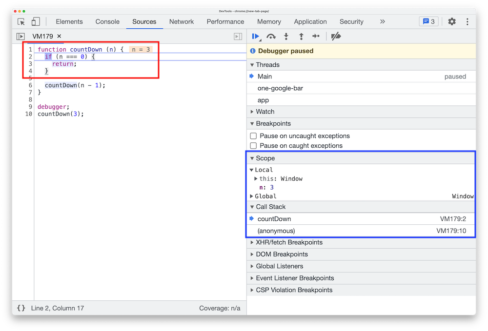

<span style={{ color: "red", fontWeight: "bold" }}>좌측의 빨간 박스</span>를 보시면, 현재 `n`이라는 매개변수의 값이 표기되고 있어 매우 유용합니다. 또한 현재 연산 중인 구문(조건문)의 색깔이 조금 더 진하게 표기되는 것을 확인할 수 있습니다. 이 뿐만 아니라, **변수에 마우스를 올리면 해당 변수의 값을 확인**할 수도 있습니다.

신기한 기분이 든다면, 아직 파티는 이릅니다.

<span style={{ color: "blue", fontWeight: "bold" }}>우측의 파란 박스</span>를 보시면, 해당 **스코프 내부의 모든 변수 정보**를 한 눈에 확인할 수 있고 콜 스택 또한 쉽게 확인할 수 있습니다. **콜 스택에 쌓인 실행 컨텍스트들을 클릭**하여 콜 스택에 쌓여있는 함수 실행문 간에 이동하며 다시 확인할 수도 있는 기능도 있습니다.

<br />
<br />

#### Step 5

개발자 도구에서 <span style={{ color: "green", fontWeight: "bold" }}>Step OVER 버튼을 1회</span> → <span style={{ color: "green", fontWeight: "bold" }}>Step IN 버튼을 1회 클릭</span>해보세요. 아래와 같은 상태로 변경될 것입니다.

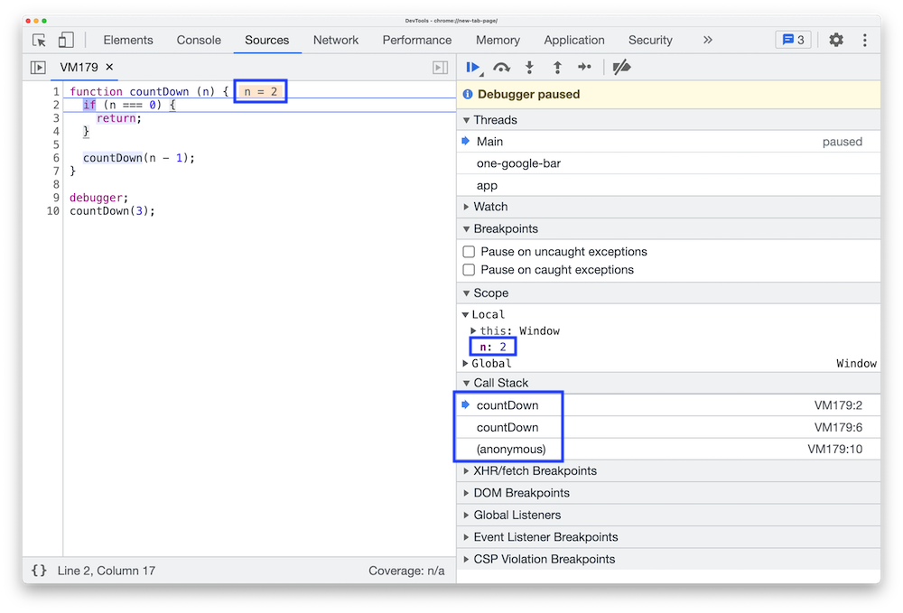

`n`의 값이 2로 변경되어 `countDown` 함수가 실행된 것을 확인할 수 있으신가요?

콜 스택 또한 확인해보시면 새로운 실행 컨텍스트가 쌓인 것을 확인할 수 있습니다.

<br />
<Alert
  showIcon
  message="콜 스택 정보에서 각각의 countDown을 클릭해보며 스코프 정보가 변경되는 것을 확인해보세요. 이전에 실행되어 스택 구조 아래에 쌓여있는 countDown 실행 컨텍스트의 스코프 정보 또한 확인할 수 있습니다."
  type="info"
/>

이제 Step out 기능도 한번 사용해볼까요?

<br />
<br />

#### Step 6

기억하실지 모르겠지만, 방금 Step 5에서 우리는 Step in을 이용하여 `countDown` 함수 실행문 내부로 진입해 있는 상태입니다. 그렇기에 Step out을 사용할 수 있습니다.

자, 그렇다면 이제 개발자 도구에서 <span style={{ color: "green", fontWeight: "bold" }}>Step OUT 버튼을 1회 클릭</span>해보세요.

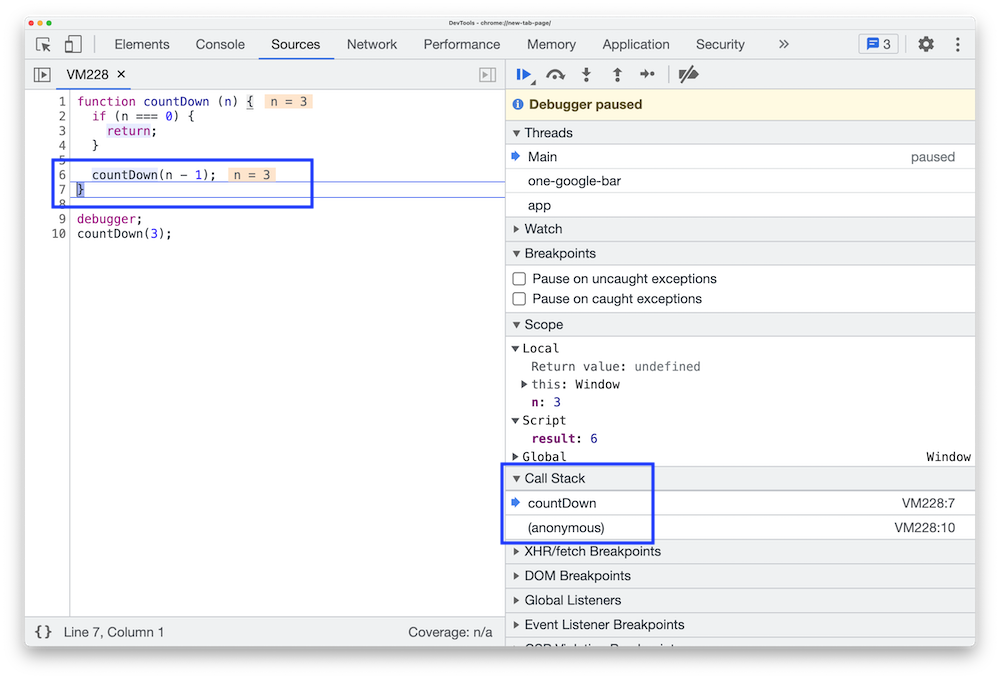

다시 `n`이 3이던 이전 함수 실행 시점으로 되돌아 왔고, 콜 스택에서도 실행 컨텍스트가 하나 제거되어 있는 것을 확인할 수 있으신가요? **우리가 n = 2 였던 함수 실행문으로부터 빠져나왔기 때문에 해당 함수 실행에 대한 실행 컨텍스트가 제거된 것입니다.**

<br />
<br />

#### Step 7

이렇게 자세히 코드의 흐름을 살펴보는 과정에서 우리가 원하는 정보를 모두 취득하고, 이제 빠져나가고 싶은 시점이 생길 수 있겠죠?

자, 이제 <span style={{ color: "green", fontWeight: "bold" }}>Play 버튼을 1회 클릭</span>해보세요.

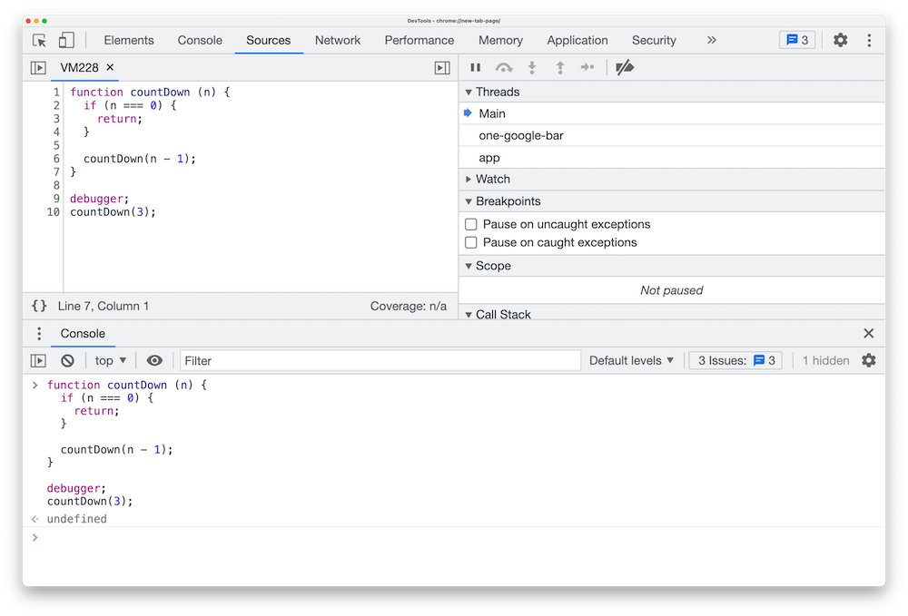

모든 디버깅 과정이 종료되고, 우리의 코드 실행문들이 재개되어 코드 실행이 종료되는 것을 확인할 수 있습니다.

<br />
<br />

#### `debugger` 응용법

`debugger`도 결국 코드입니다. 즉, 조건문이나 기타 로직에 따라 `debugger` 구문의 실행을 제어할 수 있습니다.

사실 단순한 사실인데, 의외로 많은 사람들이 깜짝 놀라는 부분입니다.

```js showLineNumbers copy
function countDown (n) {
  if (n === 1) {
    debugger;
  }

  if (n === 0) {
    return;
  }
 
  countDown(n - 1);
}

countDown(3);
```

<br/>
<br/>

### 재귀를 구현하려 하지 말 것

소제목이 조금 어그로가 있기는 하지만, 나름대로 의미가 있으니 주의깊게 봐주시기 바랍니다.

재귀를 처음 접하시는 분들이 재귀를 시도해보기 가장 좋은 로직은 **재귀적인 탐색**이라고 생각합니다. 재귀적인 탐색이란, 아래와 같은 경우를 의미합니다.

예를 들어, 우리가 [`document.getElementById`](https://developer.mozilla.org/ko/docs/Web/API/Document/getElementById)과 같은 기능을 하는 함수를 작성한다고 생각해봅시다.

`document.body`를 시작점으로 하여, 모든 자식 요소들의 아이디를 확인해야 합니다. 만약 자식 요소들이 또 자식 요소들을 갖고 있다면, 그 자식 요소들 또한 확인해야 합니다. 웹 페이지는 웹 페이지마다 구조가 다르기 때문에, 우리는 문서의 끝이 어디인지 예측할 수 없습니다.

요소들을 탐색하는 과정의 종료 조건은 두 가지 중 하나가 충족 되어야 합니다.

- 원하는 아이디를 가진 요소를 찾았을 경우
- 모든 문서를 탐색했지만, 원하는 아이디를 가진 요소를 찾지 못했을 경우

재귀가 익숙치 않은 분들이 흔히 하는 실수 중 하나는, 너무 많은 것들을 한번에 다 성취하려고 한다는 것입니다. 그러다보니 모든 단계를 건너 뛰고, 완성체의 재귀함수를 이미 머릿속에 염두하고 코드를 작성하려 합니다. 하지만 문제는 머릿속에 염두해두었던 완성체의 재귀함수가 잘못된 로직이었다는 것입니다.

그렇기 때문에 저는 더더욱 재귀를 의식하지 말고 실제로 구현해야 하는 로직을 1차적으로 작성해보라고 말씀드립니다. 모든 재귀함수에 적용 가능한 것은 아니지만, 재귀적인 탐색을 구현하는데 있어서는 이 접근 방향이 가능하고, 매우 많은 재귀함수가 탐색 로직입니다. 그렇기에 아주 좋은 훈련 방식이 될 것입니다.

재귀를 의식하지 말고 실제로 구현해야 하는 로직을 작성해보라는 의미는 무엇일까요? 아래 예시를 통해 한번 보여드리겠습니다.

<br />
<br />

#### 반복되는 로직을 최소한 3차례 작성하자

```js showLineNumbers copy
function getElementById (id) {
  const root = document.body;

  for (let i = 0; i < root.children.length; i++) {
    const child = root.children[i];

    if (child.id === id) {
      return child;
    }
  }
}
```

우선 `document.body`를 기준으로 1단계 깊이의 자식 요소들만을 탐색하는 로직을 작성했습니다. 만약 아이디가 일치하는 요소를 찾게 된다면 다행이지만, 그렇지 못하다면 우리는 자식 요소들의 자식 요소들을 또 다시 탐색해야 합니다. 저는 그 로직 또한 계속 작성해보겠습니다.

```js showLineNumbers copy
function getElementById (id) {
  const root = document.body;

  for (let i = 0; i < root.children.length; i++) {
    const child = root.children[i];

    if (child.id === id) {
      return child;
    }

    if (child.children.length) {
      for (let j = 0; j < child.children.length; j++) {
        const grandChild = child.children[j];

        if (grandChild.id === id) {
          return grandChild;
        }
      }
    }
  }
}
```

`document.body`를 기준으로 2단계 깊이의 자식 요소들까지 탐색하는 로직을 작성했습니다. 하지만 여기서도 끝이 아닙니다. 이쯤되면 많은 사람들은 인내심을 잃고 훨씬 더 예쁜 코드를 쓰기 위해 급발진 하겠지만, 저는 상황을 조금 더 지켜보며 못생긴 코드를 작성해보겠습니다.

```js showLineNumbers copy
function getElementById (id) {
  const root = document.body;

  for (let i = 0; i < root.children.length; i++) {
    const child = root.children[i];

    if (child.id === id) {
      return child;
    }

    if (child.children.length) {
      for (let j = 0; j < child.children.length; j++) {
        const grandChild = child.children[j];

        if (grandChild.id === id) {
          return grandChild;
        }

        if (grandChild.children.length) {
          for (let k = 0; k < grandChild.children.length; k++) {
            const greatGrandChild = grandChild.children[k];

            if (greatGrandChild.id === id) {
              return greatGrandChild;
            }
          }
        }
      }
    }
  }
}
```

자, 이제 3단계 깊이까지 작성했습니다. 코드를 보니 어떤 흐름이 보이시나요? 공통적인 흐름이 보이시나요? 3번 정도 반복해서 작성해보니, 시간은 조금 소요되었지만 반복되는 패턴이 눈에 더욱 뚜렷하게 나타나게 된 것 같습니다.

```js showLineNumbers {5-10, 12-18, 20-26} copy
function getElementById (id) {
  const root = document.body;

  // document.body는 항상 `children`이 존재하기 때문에 조건문이 생략되었습니다.
  for (let i = 0; i < root.children.length; i++) {
    const child = root.children[i];

    if (child.id === id) {
      return child;
    }

    if (child.children.length) {
      for (let j = 0; j < child.children.length; j++) {
        const grandChild = child.children[j];

        if (grandChild.id === id) {
          return grandChild;
        }

        if (grandChild.children.length) {
          for (let k = 0; k < grandChild.children.length; k++) {
            const greatGrandChild = grandChild.children[k];

            if (greatGrandChild.id === id) {
              return greatGrandChild;
            }
          }
        }
      }
    }
  }
}
```

우리가 이제 해야 할 일은 조금 더 뚜렷해졌습니다. **눈에 보이는 공통 로직을 재귀함수로 만드는 것**입니다. 하지만 이 과정에서 몇 가지 신중히 처리해야 할 부분들이 있습니다.

<br />
<br />

#### 반복되는 공통 로직에서 차이점을 찾도록 하자

현재 공통 로직을 잘 보시면 차이점이 있습니다. 6번째 줄, 14번째 줄, 22번째 줄의 대상이 각각 `root`, `child`, `grandChild`로 변경되고 있는 것입니다. 변경되는 부분은 어떻게 처리하면 좋을까요?

잘 생각해보시면 우리는 현재 재귀**함수**를 만들려고 하고 있습니다. 함수에서 가변적인 값을 처리하는 가장 손쉬운 방법은 무엇일까요? 그렇죠, 바로 **매개변수입니다.** **반복되는 패턴 속에서 변하는 부분을 찾고, 변하는 값들은 매개변수로 처리되도록 재귀함수를 만들어주면 됩니다.**

```js showLineNumbers copy
function getElementById (targetElement, id) {
  if (targetElement.children.length) {
    for (let i = 0; i < targetElement.children.length; i++) {
      const child = targetElement.children[i];

      if (child.id === id) {
        return child;
      }

      getElementById(child, id);
    }
  }
}

const result = getElementById(document.body, "some-id");
```

한 단계 진보한 것은 사실이지만, 아직 완성되지 않았습니다. 이렇게 작성해놓고 "왜 안되지?"라고 고민하고 있는 분들의 뒷모습을 볼때가 많습니다.

매우 중요한 부분이 남았습니다.

<br/>
<br/>

#### 재귀함수들의 반환값들을 연결하자

```js showLineNumbers /getElementById(child)/ copy
function getElementById (targetElement, id) {
  if (targetElement.children.length) {
    for (let i = 0; i < targetElement.children.length; i++) {
      const child = targetElement.children[i];

      if (child.id === id) {
        return child;
      }

      getElementById(child, id);
    }
  }
}

const result = getElementById(document.body, "some-id");
```

<br />
<Alert
  showIcon
  message="함수 실행 구문은 함수의 반환값으로 치환할 수 있습니다."
  type="info"
/>

`getElementById` 함수가 실행되고, 6번째 줄의 조건문이 충족되지 않아 10번째 줄의 재귀함수가 호출되었다고 가정해봅시다. 우리는 10번째 줄의 재귀함수가 어떤 반환값을 돌려주기를 기대하고 그 반환값이 결과값으로 연결되기를 기대할 것입니다.

10번째 줄의 재귀함수 실행문이 동일한 아이디를 가진 요소를 찾았다고 상황을 가정하고, 해당 반환값으로 치환해보겠습니다.

```js showLineNumbers /someElementWithSameId/ copy
function getElementById (targetElement, id) {
  if (targetElement.children.length) {
    for (let i = 0; i < targetElement.children.length; i++) {
      const child = targetElement.children[i];

      if (child.id === id) {
        return child;
      }

      someElementWithSameId;
    }
  }
}

const result = getElementById(document.body, "some-id");
```

여러분이 현재 보시는 위의 `getElementById` 함수에서 `someElementWithSameId`를 <b>"반환(return)"</b>해주어야 15번째 줄의 `result` 변수에 올바른 결과가 전달되게 되는데, 현재 작성한 코드대로라면 그 연결고리가 끊겨있는 상태인 것입니다.

그리고 `document.getElementById`는 원하는 요소를 찾지 못했을때 `null`을 반환한다는 부분을 감안하여 우리의 로직을 최종적으로 보완한다면 아래와 같은 결과물이 나올 수 있습니다.

```js showLineNumbers copy
function getElementById (targetElement, id) {
  if (targetElement.children.length) {
    for (let i = 0; i < targetElement.children.length; i++) {
      const child = targetElement.children[i];

      if (child.id === id) {
        return child;
      }

      const result = getElementById(child, id);

      if (result) {
        return result;
      }
    }
  }

  return null;
}

const result = getElementById(document.body, "some-id");
```

<br/>
<br/>

처음 접하는 재귀는 어렵지만, 알고보면 재미있습니다. 1-2주일 내에 친숙해지기는 어렵겠지만, 시간을 갖고 꾸준히 다가가 보시면 좋을것 같습니다.
