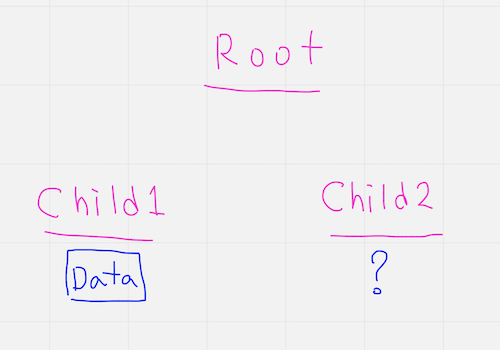
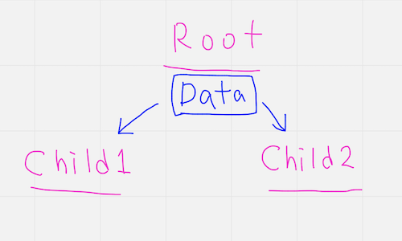

import { Sandpack } from "@codesandbox/sandpack-react";
import { githubLight } from "@codesandbox/sandpack-themes";

# 리액트의 데이터 흐름

아래에 두 개의 함수가 있습니다. `processOne` 함수에서 연산된 값을 `processTwo` 함수에서 사용하고 싶습니다.

```js showLineNumbers {5-6, 10-11}
function processOne() {
  const a = 1;
  const b = 2;

  // 이 결과 값을 `processTwo` 함수에게 전달하고 싶습니다.
  const result = a * b * 3;
}

function processTwo() {
  // 위의 `result` 결과값을 이 곳에서 사용하고 싶습니다. 🧐
  const finalResult = result * 2;
}

processOne();
processTwo();
```

`processTwo` 함수는 어떻게 하면 `processOne` 함수 내부에 있는 `result` 변수의 값을 사용할 수 있을까요?

해결 방법은 여러가지가 있을 수 있겠지만, 그 중 한 가지 방법은 **`result` 변수가 선언된 위치를 상위 스코프로 옮기는 것**입니다. 상위 스코프에 있는 값은 `processTwo` 함수에서도 접근 가능하기 때문에, 우리가 당면했던 문제를 해결할 수 있습니다.

```js showLineNumbers {1, 7-8, 12-13}
let result = null;

function processOne() {
  const a = 1;
  const b = 2;

  // `result` 변수에 결과값을 할당합니다.
  result = a * b * 3;
}

function processTwo() {
  // `result` 결과값에 접근이 가능합니다. 🧐
  const finalResult = result * 2;
}

processOne();
processTwo();
```

<br />
<br />

## 컴포넌트 간의 데이터 공유

리액트에서도 유사한 상황이 발생할 수 있습니다. 아래의 그림을 잠시 살펴보세요.



`Root`라는 컴포넌트가 최상위에 위치해 있고, 그 하위에 `Child1`과 `Child2` 컴포넌트가 자식 컴포넌트로 존재합니다. 그리고 `Child1` 컴포넌트는 가칭 `Data`라는 상태값을 가지고 있고, 이 상태값을 `Child2` 컴포넌트 또한 필요로 하는 상황입니다.

> 어떻게 하면 `Child2` 컴포넌트는 `Data`에 접근할 수 있을까요?

<br />
<br />

이전에 보여드렸던 `processOne`과 `processTwo` 함수의 예시와 유사한 방식으로 해결이 가능합니다.



`Data`라는 상태의 위치를 끌어올려 `Root` 컴포넌트가 소유하도록 하고, 해당 데이터를 필요로 하는 자식 컴포넌트들에게 Props로 전달하여 사용하도록 하는 방식입니다.

정확히 말하자면, 무작정 상위 컴포넌트로 상태값의 위치를 끌어올리는 것이 아니라 **데이터를 공유해야 하는 컴포넌트들의 <span style={{ textDecoration: "underline" }}>가장 가까운</span> 공통 부모 컴포넌트에게 상태를 끌어올려야 합니다.**

> 리액트는 기본적으로 **단방향 데이터 흐름의 구조**를 갖고 있습니다. 부모 컴포넌트에서 자식 컴포넌트로 Props를 통해 데이터를 전달할 수 밖에 없습니다. 그렇기에 데이터의 위치를 상위로 끌어올리는 방법이 유일합니다.

<br />
<br />

한번 코드로 살펴볼까요?

<br />

<Sandpack
  template="react"
  theme={githubLight}
  files={{
    "/SignupForm.js": {
      code: `import { useState } from "react";

export default function SignupForm() {
  const [username, setUsername] = useState("");

  function handleSubmit(ev) {
    ev.preventDefault();
    alert(\`이름: \${username}\`);
  }

  return (
    <form onSubmit={handleSubmit}>
      <input value={username} onChange={(ev) => setUsername(ev.target.value)} />
    </form>
  );
}
`
    },
    "/Header.js": {
      code: `export default function Header() {
  return (
    <header>
      <p>현재 사용자: {/* 사용자 이름 */}</p>
    </header>
  );
}
`
    },
    "/index.js": {
      code: `import { createRoot } from "react-dom/client";
import Header from "./Header";
import SignupForm from "./SignupForm";

function App() {
  return (
    <>
      <Header />
      <SignupForm />
      <p>이름을 입력하고 Enter를 눌러보세요.</p>
      <p>SignupForm 컴포넌트 내부에 있는 상태를 Header 컴포넌트에 전달하고 싶습니다. 자세한 내용은 아래 설명을 읽어주세요.</p>
    </>
  );
}

const root = createRoot(document.getElementById("root"));

root.render(<App />);
`,
      active: true
    }
  }}
  options={{
    showLineNumbers: true,
    editorHeight: "500px",
    editorWidthPercentage: 60,
    initMode: "lazy",
    autoReload: false,
    showConsoleButton: true,
    showConsole: true,
  }}
  customSetup={{
    entry: "index.js",
  }}
/>

위 예제에서 우리는 `SignupForm` 컴포넌트 내부에 있는 사용자 이름을 관리하는 상태 데이터를 `Header` 컴포넌트에게 전달하고 싶습니다. 하지만 현재로서는 `Header` 컴포넌트에서 `username` 값에 접근할 수 있는 방법이 없습니다.

현재 데이터를 공유해야 하는 컴포넌트들은 `SignupForm` 컴포넌트와 `Header` 컴포넌트입니다. 이 문제를 해결하기 위해서 우리는 두 컴포넌트들의 **가장 가까운 공통 부모 컴포넌트**를 찾아야 합니다.

당연하지만, (유일한) 가장 가까운 공통 부모 컴포넌트는 `App` 컴포넌트입니다. 그렇다면 `App` 컴포넌트로 상태값의 위치를 옮겨주고, `SignupForm` 컴포넌트와 `Header` 컴포넌트에서는 Props로 전달받아 사용하도록 재구성해보겠습니다.

<br />

<Sandpack
  template="react"
  theme={githubLight}
  files={{
    "/SignupForm.js": {
      code: `import { useState } from "react";

export default function SignupForm({
  username,
  onChange,
  onSubmit
}) {
  function handleSubmit(ev) {
    ev.preventDefault();
    onSubmit();
  }

  return (
    <form onSubmit={handleSubmit}>
      <input
        value={username}
        onChange={(ev) => onChange(ev.target.value)}
      />
    </form>
  );
}
`
    },
    "/Header.js": {
      code: `export default function Header({ username }) {
  return (
    <header>
      <p>현재 사용자: {username}</p>
    </header>
  );
}
`
    },
    "/index.js": {
      code: `import { useState } from "react";
import { createRoot } from "react-dom/client";
import Header from "./Header";
import SignupForm from "./SignupForm";

function App() {
  const [username, setUsername] = useState("");

  function onSignupFormSubmit () {
    alert(username);
  }

  return (
    <>
      <Header username={username} />
      <SignupForm
        username={username}
        onChange={(value) => setUsername(value)}
        onSubmit={onSignupFormSubmit}
      />
      <p>이름을 입력하고 Enter를 눌러보세요.</p>
    </>
  );
}

const root = createRoot(document.getElementById("root"));

root.render(<App />);
`,
      active: true
    }
  }}
  options={{
    showLineNumbers: true,
    editorHeight: "700px",
    editorWidthPercentage: 60,
    initMode: "lazy",
    autoReload: false,
    showConsoleButton: true,
    showConsole: true,
  }}
  customSetup={{
    entry: "index.js",
  }}
/>

위에서 시도한 방법은 많은 상황에 적용될 수 있습니다. 컴포넌트 트리 구조 내에서 Sibling 관계나 그와 유사한 관계에 있는 컴포넌트 간에 데이터를 공유해야 할 경우, 위와 동일한 패턴의 방법으로 해결할 수 있습니다.

<br />
<br />

### 📘 공식문서

- [컴포넌트 간 State 공유하기](https://ko.react.dev/learn/sharing-state-between-components)

> 도전 과제까지 반드시 해보세요.

<br />
<br />

### 꼭 기억할 것

> React 애플리케이션 안에서 변경이 일어나는 데이터에 대해서는 **진실의 원천**을 하나만 두어야 합니다.
>
> 일반적인 경우, 상태(state)는 그 상태값을 필요로 하는 컴포넌트에 먼저 추가됩니다. 그 이후에 다른 컴포넌트도 역시 그 상태값이 필요하다는 판단이 서게 되면, 그들의 **가장 가까운 공통 부모 컴포넌트**로 끌어올리면 됩니다.
>
> 항상 리액트 컴포넌트 간의 데이터 흐름은 **하향식**으로 진행하기를 강력하게 권장합니다.
