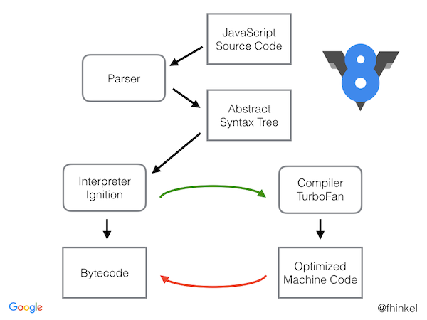

import { Alert } from "antd";
import { Callout } from "nextra-theme-docs";

# Node.js 맛보기

<br/>


<br/>
<br/>

자바스크립트는 브라우저에서 사용되기 위해 태어난 언어입니다. 초기의 자바스크립트는 주로 브라우저의 DOM을 조작하여 사용자의 움직임에 반응하는 웹사이트를 만들기 위해 사용되었습니다.

간단한 인터랙션을 목적으로 사용되던 자바스크립트였지만, V8 등 자바스크립트 엔진의 발전으로 인해 그 이상의 일들을 해낼 수 있는 성능을 갖게 되었습니다.

자바스크립트를 브라우저에서 실행할 수 있는 이유는, 브라우저에 “자바스크립트 엔진” 이 탑재되어 있기 때문입니다. 크롬에는 **V8 이라는 이름의 자바스크립트 엔진**이 탑재되어 있습니다.

<br/>
<br/>


_[V8 (JavaScript engine) - Wikipedia](https://en.wikipedia.org/wiki/V8_(JavaScript_engine))_

<br/>
<br/>

브라우저가 자바스크립트를 실행할 수 있다는 것은 다들 알고 계시겠죠? 브라우저는 자바스크립트를 실행할 수 있는 능력이 있기 때문에, 웹페이지에 삽입된 스크립트에서 혹은 개발자 도구의 콘솔에서 우리는 자바스크립트가 실행될 수 있다는 사실을 알고 있습니다.

예를 들어, 만약 우리가 개발자 도구의 콘솔에 자바스크립트 코드를 입력하면 브라우저는 이것을 자바스크립트 엔진으로 해석하여 우리에게 실행결과를 전달합니다.

브라우저는 지속적으로 발전해왔고, 이와 함께 자바스크립트 또한 많이 발전해왔습니다. 이러한 자바스크립트의 성능 발전을 배경으로 Google maps 등 자바스크립트의 성능을 잘 활용한 웹 어플리케이션들이 여럿 등장하면서 자바스크립트에 대한 인식이 달라졌고, 자바스크립트를 조금 더 다양한 상황 속에서 사용하고 싶다는 니즈가 생기게 되었습니다.

2009년, 마침내 Ryan Dahl(라이언 달)이라는 개발자가 오픈소스였던 크롬의 V8 엔진을 이용하여 브라우저 이외의 환경에서도 자바스크립트를 실행시킬 수 있는 환경을 구축했습니다. 그것이 바로 Node.js입니다.

<br/>
<br/>


_[Ryan Dahl - Wikipedia](https://en.wikipedia.org/wiki/Ryan_Dahl)_

<br/>
<br/>

<br />
<Alert
  showIcon
  message="(한글 자막 사용가능) 처음부터 끝까지 자세히 시청해보시고 이해되지 않는 내용에 대해 조사해보세요."
  type="info"
/>

<iframe width="560" height="315" src="https://www.youtube.com/embed/M3BM9TB-8yA" title="YouTube video player" frameborder="0" allow="accelerometer; autoplay; clipboard-write; encrypted-media; gyroscope; picture-in-picture; web-share" allowfullscreen></iframe>_Ryan Dahl at JSConf EU 2019_

<br/>
<br/>

## Node.js 사용해보기

Node.js를 사용해 브라우저가 아닌 환경에서 자바스크립트 코드를 직접 실행해보는 경험을 해보시길 바랍니다.

<br/>

1. 우선 아래 명령어를 통해 여러분 컴퓨터에 Node.js가 설치되어 있는지 확인할 수 있습니다.

```shell
node --version
```

<br/>

2. 여러분께서 원하는 경로에 `index.js` 등 원하는 이름의 자바스크립트 파일을 만들고, 아래와 같이 자바스크립트 코드를 작성해보세요.
    
```js
setTimeout(() => {
  console.log("안녕하thㅔ요!");
}, 100);
```

<br/>

3. 터미널에서 `node <파일경로>/<파일이름>.js` 명령어로 해당 파일을 실행해보세요.

<br/>

성공적으로 자바스크립트 코드가 실행되었고, 터미널에 문자열이 출력되었나요?

우리는 "당연히 실행되는 것이 아닌가?" 라는 생각이 들지만, 저와 같은 10여년 전의 사람들은 "드디어 브라우저가 아닌 곳에서도 자바스크립트를 실행할 수 있구나!" 라는 생각을 했지 않았을까 싶네요.

그런데 자바스크립트를 브라우저가 아닌 환경에서 사용할 수 있게 된 것이 왜 대단한 일일까요? 그냥 브라우저에서 사용하면 되는 것 아닌가요?

Node.js 환경을 통해 자바스크립트를 운영체제 환경에서도 사용할 수 있게 되면서, 대표적으로 자바스크립트로 "서버" 를 구현할 수 있게 되었습니다. 그러나 파이썬이나 자바와 같은 다른 프로그래밍 언어로도 "서버"를 구현할 수 있는데, 왜 자바스크립트로 서버를 구현할까요? 자바스크립트로 서버를 구현할 때의 장점들을 간략하게 설명하자면 아래와 같습니다.

<br/>
<br/>

## Why Node.js?

<br/>

### 1. 성능

뛰어난 성능이 가장 대표적인 장점입니다. 하지만 성능이라는 것은 사실 개발자의 구현 방식에 따라 차이가 생길 수도 있기 때문에, 언제나 뛰어난 성능이 보장되는 것은 아닙니다.

예를 들어, 마이클 슈마허(유명 레이서)와 여러분이 자동차 경주를 한다고 생각해보세요. 여러분은 꽤나 성능이 좋은 자동차를 타고, 마이클 슈마허는 조금 연식이 오래된 자동차를 탑니다. 과연 레이싱에서 누가 이길까요?

도구가 좋다고 해서 결과도 좋은 것은 아닙니다. 그렇기에 여러분이 좋은 코드를 작성하는 것이 중요합니다. 그리고 또한, 쥬니어 개발자들은 (채용 절차 상의 이유로) 성능에 필요 이상으로 집중하는 경향이 자주 있지만 현업에서는 성능보다 훨씬 우선시 되는 요소들이 사실 많습니다.

<br/>

### 2. 통일성

노드는 파일 시스템 관리를 할 수 있고 네트워크 요청을 할 수 있는 기능도 있습니다. 그렇기에 노드를 이용해 백엔드 서버를 구현할 수 있습니다.

자바스크립트로 서버를 구현할 수 있다는 사실은 엄청난 장점입니다. 프론트엔드와 백엔드를 같은 언어로 만들 수 있기 때문입니다. 팀 내의 백엔드/프론트엔드 개발자들 사이의 의사소통도 더욱 효율적이게 되고, 서로 업무를 교류할 수 있는 접점이 자연스레 많아집니다.

통일된 언어로 하나의 프로젝트를 완성함으로서 개발팀의 효율이 크게 증가합니다.

<br/>

### 3. 커뮤니티

Node Package Manager(NPM)은 재사용 가능한 수백만 혹은 수천만개의 소프트웨어 패키지에 대한 접근을 가능하게 합니다. 훌륭한 커뮤니티가 있기 때문에, 우리가 어떤 문제에 봉착하더라도 나와 비슷한 문제점을 겪은 사람 혹은 내가 겪은 문제를 해결한 사람이 있기 마련입니다. NPM만큼 규모가 크고 활성화되어 운영되는 커뮤니티는 다른 언어에서 좀처럼 찾아보기 어렵습니다. 그렇기에 Node.js만의 특장점이라고 볼 수 있습니다.

<br/>
