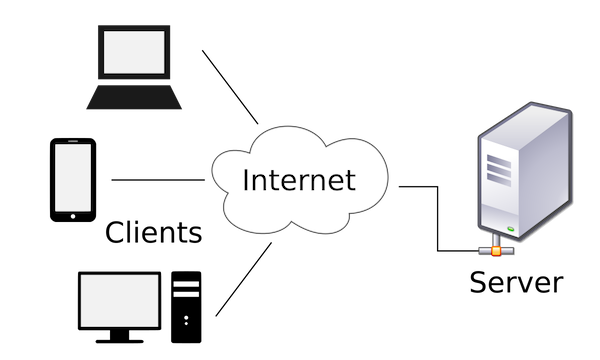

import { Alert } from "antd";
import { Callout } from "nextra-theme-docs";

# Node.js로 웹서버 만들기

<br/>

이전에서 알아보았듯이 Node.js 는 브라우저가 아닌 환경에서도 자바스크립트 코드를 실행할 수 있도록 만들어진 실행환경입니다. 그에 따라 우리는 데스크탑 운영체제에서도 자바스크립트를 실행할 수 있다고 배웠습니다.

이에 따른 큰 자바스크립트 생태계의 변화중 하나는 바로

> "자바스크립트로도 서버를 구현할 수 있게 되었다"

는 것입니다.

그렇다면 서버란 무엇일까요?

<br/>
<br/>

## 서버란?

<br/>



_서버와 클라이언트_

<br/>
<br/>

서버는 그 의미 그대로 "네트워크 상에서 어떤 데이터 리소스에 대한 접근(조회, 수정, 삭제 등)을 제어하는 컴퓨터" 입니다. 우리가 정보를 제공받는 손님 컴퓨터(= 클라이언트, 보통은 브라우저)로서 웹페이지를 이용할 때, 해당 웹페이지를 만들어내기 위한 모든 정보는 서버로부터 제공받습니다.

Node.js가 만들어지기 이전의 자바스크립트는 브라우저 환경, 즉 클라이언트 환경에서만 이용되었고 따라서 자바스크립트로 할 수 있는 일은 서버에서 만들어져 제공받은 웹페이지의 DOM을 조작하여 인터랙티브한 문서를 만드는 정도에 그쳤습니다. (자바스크립트를 html의 script 태그 안에서만 사용할 수 있다고 상상해보세요.)

그러나 Node.js의 등장으로 인해 자바스크립트로도 서버 컴퓨터의 운영체제 환경에서 작동할 수 있는 코드를 작성할 수 있게 되었고, 이로 인해 자바스크립트의 개발환경이 크게 확장되어 지금의 “프론트엔드 개발자” 라는 포지션이 각광받게 될 수 있었다고 해도 과언이 아닙니다. 여러분이 React 등 여러가지 자바스크립트 라이브러리를 이용해 편리하게 웹 서비스를 개발하고 배포할 수 있는 것도 Node.js로 구현된 모듈 시스템과 패키지 매니저의 덕분입니다.

<br/>
<br/>

## HTTP 요청과 응답

<br/>

자, 이제 클라이언트와 서버가 동적하는 방식을 알아보도록 하겠습니다.

> 클라이언트는 서버에 요청을 보내고, 서버는 요청에 걸맞는 응답을 보냅니다.

간단하게 보자면, 이것이 전부입니다.

단, 요청과 응답은 "HTTP"(Hypertext Transfer Protocol)이라는 약속(scheme)에 기반하여 요청과 응답을 주고받습니다. HTTP에는 요청과 응답 각각에 어떤 정보들이 포함될 수 있는지에 대한 약속들이 미리 정의되어 있습니다. 아래 MDN 문서에서 간단히 HTTP에 대한 내용을 확인해보세요.

_[An overview of HTTP - HTTP | MDN](https://developer.mozilla.org/en-US/docs/Web/HTTP/Overview)_

요청과 응답에 대한 자세한 내용은 아래의 예시와 함께 살펴보도록 하겠습니다.

<br/>

##### 예시 #1

아래 예시는 Node.js가 제공하는 기본 메서드로 구현된 아주 간단한 서버입니다.

```js showLineNumbers copy
// 서버 생성을 위해 필요한 nodejs의 http 모듈
const http = require("http");

// 서버에 들어오는 요청을 처리하기 위한 함수
function requestHandler(req, res) {
	// 요청에 대한 응답으로, "Hello World" 라는 문자열을 담아 전달한다.
  res.end("Hello World");
}

// 서버 생성
const server = http.createServer(requestHandler);

// 8080번 포트를 이용하여 서버 실행
server.listen(8080);

console.log("Server running at http://127.0.0.1:8080");
```

여러분의 컴퓨터에 Node.js가 설치되어 있다면 어디에서든 위와 같은 내용의 파일을 만들고 `node <파일경로>/<파일이름>.js` 형식의 명령어를 이용해 서버를 실행시킬 수 있습니다.

위 내용의 파일을 만드셨다면, 브라우저에서 `http://127.0.0.1:8080` 주소를 방문해보세요. `Hello World`가 나타났나요?

그렇다면 Ctrl + C를 통해 실행 중인 서버를 종료시키고, `Hello World` 문자열을 여러분께서 원하시는 다른 내용의 문자열로 교체해보세요. 그리고 다시 서버를 실행한 후, 브라우저에 방문해보세요.

새로운 문자열의 내용이 브라우저에 표기되었나요?

여러분은 방금 Node.js를 활용하여 웹 서버를 구축한 경험을 한 것입니다. 그렇다면, 조금 더 복잡한 예시를 살펴볼까요?

<br/>
<br/>

##### 예시 #2

이번에는 조금 더 구체적인 요청과 응답을 주고받는 서버를 살펴보겠습니다.

[코드 샌드박스 예시](https://codesandbox.io/s/node-basics-itsqh)를 다운로드 받아보세요. 좌측 상단의 햄버거 메뉴 - File - Export to zip을 통해 다운로드 받을 수 있습니다.

다운로드 받으신 후, 아래 순서로 진행해보세요.

1. 압축 해제
2. VS Code에서 열기
3. 해당 디렉토리에서 `npm install` 실행
4. 해당 디렉토리에서 `npm start` 실행
5. 브라우저에서 `http://127.0.0.1/8080` 방문 -> `Hi, World` 출력 확인
6. 브라우저에서 `http://127.0.0.1/8080/hello` 방문 -> `"Hello, World" from hello.txt` 출력 확인

<br />

위의 예시에서는 주어진 url에 따라 다른 응답을 전달하는 내용의 서버를 살펴봤습니다. 이와 같은 서버는 어떤 내용으로 이루어져 있을까요?

```js showLineNumbers copy {7, 16}
const http = require("http");
const fs = require("fs");
const path = require("path");

function requestHandler(req, res) {
  // `/hello` url로 방문한 경우에 대한 응답.
  if (req.url === "/hello" && req.method === "GET") {
    const myFile = fs.readFileSync(path.join(__dirname, "/hello.txt"), {
      encoding: "utf-8"
    });

    return res.end(myFile);
  }

  // (조건문에 부합하지 않는 경우에 대한) 기본적인 응답.
  res.end("Hi, World");
}

// 서버 생성 후, 8080 포트를 이용하여 실행.
http.createServer(requestHandler).listen(8080);

console.log("Server running at http://127.0.0.1:8080");
```

방금 주어진 코드의 응답 로직에는 크게 두 가지 경우의 수가 있습니다.

1. url이 `/hello`이며 동시에 `GET` 메소드로 요청이 들어온 경우
2. 그 외의 경우

지금은 간단히 두 가지 경우의 수만 구성해보았지만, 여러분이 이전에 사용하셨던 Cats API, Youtube API 등의 모든 서버는 이런 비슷한 부류의 로직이 매우 복잡하게 구성되어 있는 것입니다.

<br />
<br />

## HTTP 요청

<br />

위에서 살펴본 서버를 실행하고 해당 주소를 브라우저로 방문했을때, 크게 두 가지 일이 발생했습니다.

1. 브라우저(혹은 클라이언트)가 `http://127.0.0.1/8080` 주소의 서버로 자료를 요청합니다.
2. 서버에서는 해당 url과 요청 메소드에 해당하는 자료를 전달합니다. 즉, `Hi, World`라는 텍스트 자료를 응답으로 브라우저에게 전달합니다.

> 클라이언트란, 서버에 저장된 정보를 실사용자들이 소비할 수 있게끔 연결해주는 프로그램을 뜻합니다. 대표적으로 Chrome과 같은 브라우저, iOS 앱, Android 앱 등이 있습니다.

<br />

브라우저에서 접속했다는 의미는 GET 메소드를 사용한 HTTP 요청이 해당 주소로 전송되었음을 의미합니다. HTTP 네트워크 요청 메소드에는 대표적으로 아래와 같이 네 가지가 있습니다.

1. **GET** 메소드: 서버에 데이터를 찾아달라고 요청할때 사용. 예) 사용자 정보 조회하기
2. **POST** 메소드: 서버에 데이터를 생성해달라고 요청할때 사용. 예) 사용자 정보 새로 만들기 혹은 회원가입
3. **PUT** 메소드: 서버에 데이터를 수정해달라고 요청할때 사용. 예) 기존 사용자 정보 수정하기
4. **DELETE** 메소드: 서버에 데이터를 삭제해달라고 요청할때 사용. 예) 기존 사용자 탈퇴 처리

위 네 가지가 가장 중요하긴 하지만, 사실 더 많은 요청 메소드가 있습니다. 아래 자료를 추가적으로 살펴보도록 하세요.

_[HTTP 메소드](https://developer.mozilla.org/ko/docs/Web/HTTP/Methods)_

<br/>
<br/>

## HTTP 응답

<br/>

우리가 서버에 자료를 요청하게 되면, 서버는 요청을 처리하고 응답을 해주어야 합니다.

> 단일 요청에 대해 단일 응답이 전달되어야만 합니다. **반드시 1:1 관계입니다.**

그리고 응답을 해줄때는 반드시 **응답 코드(혹은 응답 상태 코드, Status code)** 가 포함되어야 합니다. 물론 상세 내용이 필요하기도 하겠지만, 간단한 응답 코드를 통해 어떤 카테고리의 응답인지를 표현해주어야 합니다. 응답 코드에는 굉장히 많은 종류가 있기에 모두 외울 필요는 없지만, 아래 나열된 정보는 알고 계시면 좋을것 같습니다.

(모든 응답코드는 3자리 숫자입니다.)

- **1XX**: 정보응답 (여러분이 알지 못하셔도 괜찮습니다.)
- **2XX**: 성공응답
- **3XX**: Redirection 응답 (다른 곳으로 보내는 것을 의미합니다.)
- **4XX**: 클라이언트 에러 응답
- **5XX**: 서버 에러 응답

(전체 응답 코드 목록도 한번 살펴보세요.)

_[HTTP 상태 코드 - HTTP | MDN](https://developer.mozilla.org/ko/docs/Web/HTTP/Status)_
