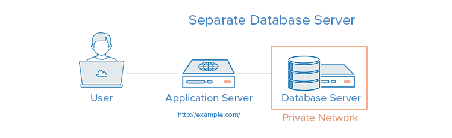

import { Alert } from "antd";
import { Callout } from "nextra-theme-docs";

# Database

데이터베이스는 쉽게 설명드리자면, 하드디스크나 SSD와 같은 존재입니다. 저장 매체(하드디스크, SSD)가 고장나거나 사용자가 직접 데이터를 지우지 않는 이상 데이터가 영구적으로 보존되는 것 처럼, 데이터베이스에 저장된 데이터들도 마찬가지 입니다. 클라우드 저장소에 자료를 업로드 한 후 로그아웃을 해도 작업물이 남아 있듯, 우리가 작업하는 서버 실행 여부와 상관없이 데이터를 계속 사용할 수  있고 우리에게 자료를 저장하고 수정하고 삭제할 수 있는 기능들을 제공합니다.

데이터베이스 또한 인터넷 세상에 연결될 수 있습니다. 그럴 경우, 데이터베이스를 구동시켜 인터넷에 연결해주는 시스템을 "데이터베이스 서버" 라고 부릅니다. 데이터베이스가 인터넷 세상에 연결되면 우리의 웹 서버(ex. Express App)는 데이터베이스와 네트워크 상에서 정보를 주고 받을 수 있게 됩니다.

<br/>



<br/>

예를 들어 위 그림에서 Application 서버는 우리가 작업하는 Express App이 될 수 있고, Database 서버는 MongoDB가 될 수 있습니다. 데이터베이스를 이용하게 되면, 우리는 우리 어플리케이션에 관련된 자료들을 영구적으로 저장하고 관리할 수 있습니다.

데이터베이스는 관계성의 유무에 따라 관계형 데이터베이스 SQL, 비관계형 데이터 베이스인 NoSQL 2가지로 나뉘게 되는데 이에 대해 알아보겠습니다.

<br/>
<br/>

## SQL(Structured Query Language) vs NoSQL

SQL과 NoSQL은 여러 차이점이 있는데, 그중에서 대표적인 몇 가지 차이점에 대해 말해보자면 다음과 같습니다.

| SQL | NoSQL |
| --- | --- |
| 규칙에 맞는 데이터 입력 | 자유로운 데이터 입력 |
| 안정성, 일관성 | 확장성, 가용성 |
| 용어(테이블, 로우, 컬럼) | 용어(컬렉션, 다큐먼트, 필드) |
| 트랜잭션 지원 | 트랜잭션 미지원 |

SQL 방식에는 대표적으로 MySQL이라는 데이터베이스가 있고, NoSQL 방식에는 대표적으로 MongoDB라는 데이터베이스가 있습니다. MongoDB는 JSON 형식의 문서를 저장하도록 되어 있어 자바스크립트 개발자가 익히기에 가장 진입 장벽이 낮습니다. 그래서 흔히 부르는 **MERN Stack**(MongoDB, Express, React, Node), **MEAN Stack**(MongoDB, Express, Angular, Node)라는 특정 기술 스택을 부르는 명칭도 존재합니다.
  
💡  이외에도 어떤 차이점이 있는지, 왜 SQL은 안정성과 일관성을 가지고 있고 NoSQL 확장성과 가용성에 용이한지에 대해서도 꼭 조사해보세요.

<br />
<br />

## 데이터 모델링

SQL, NoSQL을 구분 지을 때 관계형, 비관계형 데이터 베이스라는 측면에서 바라보듯 데이터베이스의 세계에서 관계란 아주 중요한 포인트 입니다. 이처럼 데이터들 간에도 관계가 존재하게 되는데 어떤 종류가 있는지 알아보겠습니다.

<br />

### 1:1

- 하나의 field가 1개의 값을 가진다 (1 : 1 대응 관계)

```json
// MOVIE DOCUMENT
// title 필드는 1개의 값만 가진다

{
  "_id": ObjectID("1111"),
  "title": "spiderman",
  "review": ["Good", "Bad", "Soso", "Great"],
  "actors": [
		ObjectID("3333"),
		ObjectID("4444"),
		ObjectID("5555")
	]
}
```

<br />

### One : Many

- 하나의 field가 여러개의 값을 가진다 (1 : N 대응 관계)

```json
// MOVIE DOCUMENT
// review, actors 필드는 여러개의 값을 가진다

{
  "_id": ObjectID("1111"),
  "title": "spiderman",
  "review": ["Good", "Bad", "Soso", "Great"],
  "actors": [
		ObjectID("3333"),
		ObjectID("4444"),
		ObjectID("5555")
	]
}
```

<br />

### Many : Many

- 각 필드가 서로의 참조값들을 가진다 (N : N 대응 관계)

```json
// MOVIE DOCUMENT
// movie의 actors필드는 여러 actor의 참조값을 가지고
// actor의 featured필드 또한 여러 movie의 참조값을 가진다

{
  "_id": ObjectID("1111"),
  "title": "spiderman",
  "review": ["Good", "Bad", "Soso", "Great"],
  "actors": [
		ObjectID("3333"),
		ObjectID("4444"),
		ObjectID("5555")
	]
}

{
  "_id": ObjectID("2222"),
  "title": "batman",
  "review": ["Awesome", "Sad", "Happy", "Funny"],
  "actors": [
		ObjectID("3333"),
		ObjectID("4444"),
		ObjectID("5555")
	]
}

// ACTOR DOCUMENT
{
  "_id": ObjectID("3333"),
  "name": "Ken",
  "featured": [
		ObjectID("1111"),
		ObjectID("2222")
	]
}
{
  "_id": ObjectID("4444"),
  "name": "Jett",
  "featured": [
		ObjectID("1111")
	]
}
{
  "_id": ObjectID("5555"),
  "name": "Justin",
  "featured": [
		ObjectID("2222")
	]
}
```

아래는 MongoDB에서 권장하는 데이터 모델링 방식입니다. 지금 당장 쥬니어로서 세세하게 알고 있어야 하는 내용은 아니지만, 그래도 한번쯤은 번역기를 사용해서라도 자세히 꼭 읽어보시기 바랍니다.

[6 Rules of Thumb for MongoDB Schema Design: Part 1 | MongoDB Blog](https://www.mongodb.com/blog/post/6-rules-of-thumb-for-mongodb-schema-design-part-1)

<br />
<br />

## Referencing VS Embedding

<br />

자료를 저장할 때에는 대표적으로 2가지 방식이 있습니다. 단어 뜻 그대로 referencing은 참조를 통해 값을 조회하는 방식이고 embedding은 데이터를 통째로 삽입하여 값을 저장해두는 방식입니다.

**Referencing은 정규화된 구조 즉 unique한 key 값을 통해 다른 값을 참조할 수 있게 한 구조**입니다. 각각의 document에 실행문(query)을 사용하기 좋지만, 2개 이상의 query를 통해 서로를 참조하게 해야하는 단점이 있습니다. (예를 들어, 첫 번째 query를 통해 unique한 key 값을 가져오고, 가져온 key를 바탕으로 다시 query를 보내 데이터를 조회해와야 합니다.)

```json
// REFERENCED (NORMALIZED)
// MOVIE

{
  "_id": ObjectID("222"),
  "title": "Interstellar",
  "releaseYear": 2014,
  "actors": [
    ObjectID("555"),
    ObjectID("777"),
  ]
}

// ACTOR

{
  "_id": ObjectID("555"),
  "name": "Matthew McConaughey",
  "age": 50,
  "born": "Uvalde, USA"
}

{
  "_id": ObjectID("777"),
  "name": "Ken Huh",
  "age": 20,
  "born": "NYC, USA"
}
```

**Embedding은 비정규화된 구조 즉 개별적인 정보에 대한 값들을 통째로 넣음**으로써 요청 하나로 모든 정보를 받을 수 있다는 장점이 있지만, query를 통해 field내부에 있는 각각의 값들을 받을 수 없다는 단점이 있습니다.

```json
// EMBEDDED (DENORMALIZED)

{
  "_id": ObjectID("222"),
  "title": "Interstellar",
  "releaseYear": 2014,
  "actors": [
    {
      "name": "Matthew McConaughey",
      "age": 50,
      "born": "Uvalde, USA"
    },
    {
      "name": "Ken Huh",
      "age": 20,
      "born": "NYC, USA"
    }
  ]
}
```

<br />
<br />

## 데이터베이스 인덱스

<br />

데이터베이스를 학습할 때 가장 중요한 개념 중 하나는 인덱스(색인)입니다.

우리가 읽는 책들의 뒷편을 보면 색인 목록을 쉽게 찾을 수 있습니다. 데이터베이스의 인덱스도 책의 색인과 같은 역할을 한다고 생각하면 됩니다.

만약 자바스크립트 책에서 "호이스팅" 관련 글을 찾으려고 한다면, 우선 가장 단순한 방법으로는 맨 첫쪽부터 한장 한장 확인해나가는 방법이 있을 수 있습니다. 하지만 무척 시간이 오래 걸릴 것입니다. 책 뒷편의 색인 목록을 이용하여 "호이스팅"이라는 단어가 몇 페이지에 등장하는지 확인한 후, 페이지 위치를 찾으려고 시도한다면 훨씬 적은 시간이 걸립니다. 또한 책의 페이지들은 당연히 1쪽부터 시작하여 정렬되어 있기 때문에, 이진 탐색을 이용하면 더욱 빠르게 찾을 수 있습니다.

<br />
<br />

### 인덱스의 특징

- 자료를 찾는데 걸리는 시간을 개선해주는 자료 구조 (데이터베이스에 따라 구체적인 자료 구조는 매우 상이할 수 있습니다.)
- 인덱스 구조를 저장하기 위해 추가적인 공간과 관리가 필요함
- 기본으로 인덱스 설정이 이미 되어 있는 컬럼(필드)도 있고, 우리가 별도로 지정하여 사용할 수도 있음
- 인덱스가 많다고 반드시 빠른 query로 이어지지는 않을 수도 있음
- 인덱스 목록도 관리해야 하기 때문에, 자료 생성, 수정, 삭제의 속도는 지연시킬 수 있음

<br />

> MongoDB에서는 `_id`라는 고유 아이디 필드가 항상 기본적으로 인덱스 처리되어 있습니다.

<br />
<br />
<Alert
  showIcon
  message="실제로 데이터베이스 인덱스의 설정 유무에 따른 퍼포먼스 차이를 측정해볼 수 있는 방법이 있을지 조사하고 시도해보세요."
  type="info"
/>

<br />
<br />

## Mongoose

<br />

`mongoose` 라이브러리는 MongoDB의 자료를 다룰때 주로 사용되는 **Object Document Mapping(ODM)** 라이브러리입니다. 필수는 아니지만, 많은 개발자들이 사용하는 프로그램입니다.

`mongoose`의 핵심 역할은 아래와 같습니다.

1. 자료 간의 관계 관리
2. 자료 스키마 유효성 검사 제공
3. MongoDB의 자료를 객체 지향적인 관점을 가진 코드로 다룰 수 있는 기능 제공

추가적으로 SQL 데이터베이스의 경우에는 **Object Relational Mapping(ORM)**이 많이 사용됩니다.

[[DB] ORM이란 - Heee's Development Blog](https://gmlwjd9405.github.io/2019/02/01/orm.html)

<br />
<br />

### GUI를 사용해 MongoDB 사용하기

여러분이 컴퓨터를 항상 terminal과 같은 command line interface로만 사용하지는 않습니다. 바탕화면의 아이콘을 클릭해서 프로그램을 실행하거나 폴더를 여는 등의 간단한 오퍼레이션은 GUI, Graphical User Interface를 통해 수행합니다.

MongoDB에서도 데이터베이스의 내용을 확인하거나 새로운 데이터를 입력, 수정, 삭제 등을 편리하게 하기 위해 Compass 라는 이름의 그래픽 유저 인터페이스(GUI) 툴을 제공합니다.

[Download Compass](https://www.mongodb.com/try/download/compass)

위 프로그램을 설치해놓으시고, 과제를 진행하며 데이터베이스에 저장된 내용을 확인할 필요가 있을때마다 사용해보시기 바랍니다.
